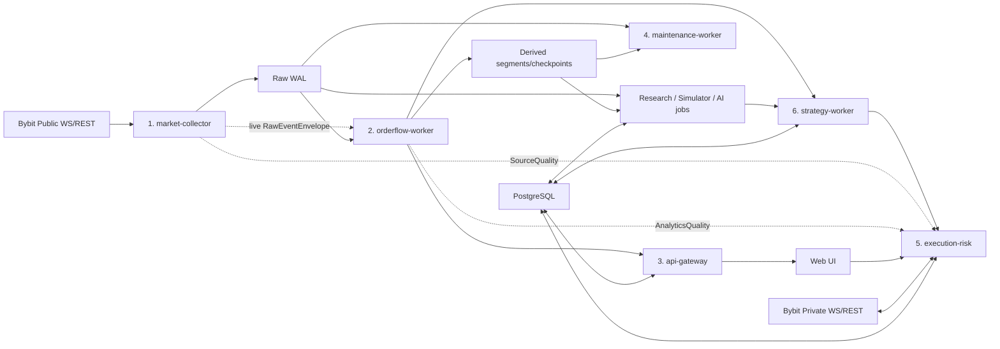

# Дорожная карта разработки многопроцессной Order Flow-платформы Bybit

**Версия документа:** 1.0  
**Дата:** 2026-08-10  
**Рынок:** Bybit V5, `category=linear`  
**Основные инструменты:** `BTCUSDT`, `ETHUSDT`, `XRPUSDT`  
**Режим эксплуатации:** один сервер, 24/7  
**Адресаты:** тимлид, backend/frontend/ML-инженеры, QA/SRE  
**Статус:** целевая архитектура и порядок внедрения

> Этот документ заменяет прежнее представление «один FastAPI-процесс —
> конечная архитектура». Доменные правила прежних спецификаций сохраняются,
> но исполняются в изолированных процессах. Сырые события остаются источником
> истины; UI, индикаторы, стратегии и ИИ являются воспроизводимыми
> потребителями данных.

> Торговые пороги и настройки стратегий в документе являются стартовыми
> исследовательскими пресетами. Они не доказывают прибыльность и не допускают
> стратегию к реальным деньгам без replay, walk-forward, out-of-sample и
> paper/demo-проверки.

## Содержание

- Управление проектом: §1–2.
- Backend и процессы: §3–9.
- Модули и визуальный стандарт: §9–10 и Приложение A.
- Frontend и рабочее место: §11.
- Индикаторы/Pine-compatible runtime: §12.
- Simulator/replay: §13.
- Стратегии и TP/SL: §14.
- Manual/AI-assisted trading и Risk Engine: §15.
- AI/ML и governance: §16.
- Internal API, безопасность и эксплуатация: §17–18.
- Этапы, выкатка, тесты и контроль тимлида: §19–25.

---

## 1. Как использовать этот документ

Документ является рабочей дорожной картой, а не обзором идей.

- Каждый этап имеет зависимости, результат и критерии приёмки.
- Этап нельзя считать завершённым, если обязательный тест был пропущен.
- `PASS`, `FAIL` и `SKIPPED (количество + причина)` — единственные допустимые
  состояния тестового набора.
- Любое изменение схемы события, алгоритма или конфигурации увеличивает
  соответствующую версию и оставляет воспроизводимый след.
- Все внутренние REST/gRPC-контракты ниже являются **проектируемыми API этой
  системы**, а не существующими endpoint Bybit.
- Все пути Bybit вынесены в отдельный раздел и сверены с официальной
  документацией V5.

### 1.1. Приоритет исходных документов

При противоречиях применять следующий порядок:

1. Этот roadmap — целевая многопроцессная архитектура и порядок работ.
2. `multi-process-architecture.md` — базовые границы процессов.
3. `all-modules-data-persistence-architecture.md` — доменные правила,
   persistence, recovery и тесты.
4. `all-modules-data-persistence-architecture-changes.md` — контрольный список
   исправлений server-first/Bybit.
5. `Bybit_Order_Flow_Heatmap_Specification.docx` — вычислительная и визуальная
   спецификация модулей.
6. `BTCUSDT_Bybit_Intraday_Strategies.md` — стартовые стратегии, TP/SL и риск.

### 1.2. Что должно быть согласовано тимлидом до начала реализации

Создать и утвердить ADR (Architecture Decision Record):

| ADR | Решение |
|---|---|
| ADR-001 | Границы процессов и запрещённые зависимости |
| ADR-002 | Protobuf-схемы, IPC и правила совместимости протокола |
| ADR-003 | Владение WAL, Parquet, manifest и checkpoint |
| ADR-004 | Каноническая integer/Decimal-модель и wire-format |
| ADR-005 | PostgreSQL для транзакционных и пользовательских данных |
| ADR-006 | DataQuality, gaps, watermark и signal gating |
| ADR-007 | Внутренний OrderIntent и единый Risk Engine |
| ADR-008 | Граница поддерживаемого Pine-compatible subset |
| ADR-009 | Симулятор исполнения и консервативная fill-модель |
| ADR-010 | Жизненный цикл ML-модели и запрет прямого доступа ИИ к бирже |
| ADR-011 | Release, rollback, backup, RPO/RTO и secrets |

### 1.3. Разделение ответственности

| Область | Тимлид (Accountable) | Софт-инженер (Responsible) |
|---|---|---|
| Архитектура | ADR, границы, owner datasets, приоритеты | Прототип контракта, реализация, измерения |
| Схемы/API | Версия и compatibility policy | Protobuf/OpenAPI, migrations, contract tests |
| Качество данных | Утверждает semantics/SLO/gates | Метрики, gaps, recovery и fault tests |
| Модули | Утверждает формулу/DoD с доменным reviewer | Код, replay, invariants, profiling |
| Frontend | Утверждает UX и опасные действия | UI, state boundaries, E2E/visual tests |
| Торговля | Утверждает risk policy/promotion | Intent ledger, adapter, reconciliation, audit |
| AI/ML | Утверждает data/model governance | Datasets, jobs, registry, leakage/drift tests |
| Release | Go/no-go, rollback authority | Immutable artifact, canary, deploy/runbook |

Если отдельного QA/SRE/quant нет, их проверки не исчезают: тимлид назначает
второго reviewer либо выполняет формальную приёмку сам. Автор изменения не
должен единолично утверждать live risk/model promotion.

---

## 2. Цель, границы и обязательные свойства продукта

### 2.1. Цель

Создать серверную платформу, которая круглосуточно:

1. Собирает невосполнимые публичные данные Bybit по трём инструментам.
2. Хранит lossless-сырьё и воспроизводимо строит Order Flow-модули.
3. Отдаёт историю и live-данные браузеру без потери при reload/смене ТФ.
4. Позволяет анализировать рынок, рисовать разметку и писать индикаторы.
5. Выполняет детерминированный replay и реалистичный event-driven backtest.
6. Поддерживает ручную, подтверждаемую и автоматическую торговлю через один
   безопасный execution-контур.
7. Позволяет ИИ-ассистенту исследовать данные, предлагать конфигурации и
   запускать симуляции без прямого доступа к торговым ключам.

`24/7` здесь означает unattended services с supervision/recovery на одном
хосте. Это не обещание zero-downtime при отказе питания, диска, сети или самого
сервера. Настоящее HA потребует второго хоста, fencing/leader election и
отдельного проекта; до него любой внешний разрыв честно фиксируется gap-marker.

### 2.2. Неподлежащие компромиссу свойства

```text
Биржевое событие сначала долговечно записывается, потом вычисляется.
Downstream-процесс не может остановить collector.
Неизвестный участок данных всегда маркируется gap, а не интерполируется.
Одинаковые raw + config + version дают одинаковый результат.
UI не является владельцем рыночной истории или ордеров.
Ручной, стратегический и AI-вход проходят один Risk/Execution Engine.
ACK биржи не считается исполнением.
Стратегия не считывает пиксели или цвета — только числовые признаки.
```

`Lossless` означает сохранение каждого принятого сообщения выбранного feed в
пределах подписанной глубины и connection epoch. Это не означает полный
биржевой MBO, уровни за L1000, RPI при выключенном RPI-feed или восстановление
участка, который вообще не был принят; такие границы видны в metadata/gaps.

### 2.3. Явные не-цели первой production-версии

- HFT/next-tick/queue-position стратегии при RTT около 200 мс.
- Точное MBO-представление чужих ордеров: Bybit public book является MBP.
- Точная классификация каждого исчезновения как fill или cancel.
- Полная совместимость с произвольным Pine Script.
- Автономный ИИ с неограниченным правом отправлять заявки.
- Multi-host HA, Kafka/Redis/ClickHouse до появления измеримой необходимости.
- Автоматическое переключение на Full Orderbook.

---

## 3. Целевая архитектура и эволюция процессов

### 3.1. Архитектура по отказным доменам



Номера отражают порядок появления, а не сетевой маршрут. После начала
автоторговли `strategy-worker` отделяется от `execution-risk`: зависшая модель
не должна задержать защитный SL, reconciliation или аварийное закрытие.

### 3.2. Переход 3 → 4 → 5 → 6 ролей

| Стадия | Долгоживущие процессы | Результат |
|---|---|---|
| 3 процесса | collector; временный analytics+API; maintenance | Производные больше не могут остановить сбор |
| 4 процесса | collector; analytics; API; maintenance | UI и вычисления изолированы |
| 5 процессов | + execution-risk | Ручная торговля и private recovery изолированы |
| 6 процессов | + strategy-worker | Автостратегия не влияет на защиту позиции |
| Research jobs | simulator/optimizer/trainer по запросу | Не входят в live latency path |

Количество экземпляров может отличаться от количества ролей. Например,
`orderflow-worker` разрешено шардировать по символу после измерений, но его
контракт и checkpoint остаются одинаковыми.

Счёт `3/4/5/6` относится только к application services. PostgreSQL,
Prometheus, reverse proxy и краткоживущие research jobs в это число не входят.

### 3.3. Ответственность и запреты процессов

#### `market-collector`

Отвечает за:

- public WebSocket/REST Bybit;
- heartbeat, reconnect, resubscribe;
- raw payload, нормализацию и дедупликацию;
- feed-specific sequence/gap controller;
- materialized L50/L1000 только для проверки и checkpoint;
- WAL, закрытие raw-сегментов и book checkpoints;
- trades, standard book, RPI raw-only, liquidations, ticker;
- scheduled REST ingestion OI/funding/kline validation с отдельными checkpoints;
- собственное `SourceQuality` по symbol/feed/depth.

Запрещено: Footprint, Heatmap tiles, Walls, Sweep, Absorption, стратегии,
frontend API, compaction, чтение больших Parquet-диапазонов.

#### `orderflow-worker`

Отвечает за:

- чтение live envelopes и догон из WAL;
- canonical candles, Footprint, Delta/CVD, VWAP/Profile;
- replay книг, Heatmap, DOM/OBI/OFI/MLOFI/microprice;
- единый `AttributionSnapshot` на feature-frame;
- Absorption, Sweep, Walls, Pulling/Stacking, liquidations;
- regime, levels, Feature API;
- revisions, snapshots, patches и derived checkpoints.

Запрещено: прямые Bybit public/private соединения, отправка ордеров,
тяжёлая compaction в live-потоке.

#### `api-gateway`

Отвечает за:

- REST history и browser WebSocket;
- `ViewSession`, snapshot + ordered patches;
- `streamEpoch`, `streamSequence`, cursor и повторный snapshot после пропуска;
- workspaces, настройки, scripts, drawings и templates;
- auth/RBAC;
- приём `OrderIntent` от UI без прямого вызова Bybit.

Запрещено: тяжёлая аналитика, PyArrow full scans в event loop, private keys.

#### `maintenance-worker`

Отвечает за:

- claim закрытых сегментов по lease;
- Parquet publication, footer/checksum validation;
- compaction, tiles, retention, manifest/index;
- recovery `.tmp`, FAILED и orphan-файлов;
- disk budget и low-priority обслуживание.

Запрещено: подписка Bybit, торговые команды, одновременный запуск нескольких
тяжёлых операций на одном диске.

#### `execution-risk`

Отвечает за:

- private WS `order/execution/position`;
- Bybit REST create/amend/cancel/reconciliation;
- durable intent/order/execution ledger;
- risk limits, idempotency и server-side SL/TP;
- trusted Source/AnalyticsQuality subscriptions и composite entry gate;
- ручные и автоматические команды через единый автомат;
- защиту открытой позиции при отказе UI/analytics/strategy.

Запрещено: вычисление тяжёлых рыночных признаков, обучение моделей, принятие
невалидированного свободного текста ИИ как торговой команды.

#### `strategy-worker`

Отвечает за:

- детерминированные автоматы стратегий;
- сохранение фактически увиденного `featureSnapshot`;
- `expiresAtMs`, regime, conflict resolution и score;
- выпуск `OrderIntentProposal`, а не сетевой вызов Bybit.

Запрещено: API keys, обход Risk Engine, использование PROVISIONAL/DEGRADED
признаков для нового входа.

#### Research / Simulator / AI jobs

Отвечают за replay, dataset building, backtest, parameter optimization,
обучение и отчёты. Запускаются отдельно, имеют read-only доступ к raw/derived
истории и пишут только versioned research artifacts.

### 3.4. Логические роли, не равные процессам

| Роль | Ключ | Время жизни |
|---|---|---|
| `MarketDataHub` | venue + category + symbol | Пока работает collector |
| `ViewSession` | workspace/client + symbol + TF + settings | Пока открыт клиент |
| `ExecutionHub` | environment + account/UID | Пока работает execution |

Смена ТФ изменяет только `ViewSession`. Она не переподключает Bybit, не
очищает book/raw state и не затрагивает private feed.

### 3.5. Рекомендуемая структура репозитория

```text
contracts/                 protobuf, Pydantic, compatibility fixtures
services/
  market_collector/        Bybit public adapters, WAL, SourceQuality
  orderflow_worker/        aggregators, features, events, checkpoints
  api_gateway/             REST/WS, auth, workspaces, browser streams
  maintenance_worker/      publication, compaction, retention, manifest
  execution_risk/          private adapter, ledger, risk, reconciliation
  strategy_worker/         deterministic strategies and signals
packages/
  numeric/                 tick/qty/Decimal primitives
  storage/                 WAL/Parquet/manifest readers and contracts
  orderflow/               pure reusable algorithms
  execution_domain/        state machine and adapter interfaces
  simulator/               clocks, fills, reports
web/                       React/TypeScript application
research/                  dataset builders, optimizer, ML jobs
deploy/                    systemd units, release/canary/rollback scripts
tests/
  fixtures/ contracts/ replay/ fault/ performance/ browser/ demo/
docs/                      ADR, runbooks, schema/module/strategy docs
```

Запреты импортов проверяются CI (например, collector не импортирует
`orderflow`, API — Bybit keys, research — execution adapter). У каждой
долгоживущей роли отдельная entry point, health endpoint/UDS probe, service
unit, resource budget и graceful shutdown deadline.

---

## 4. Рекомендуемый реальный технологический стек

Все зависимости фиксируются lock-файлом и SBOM. Версии выбираются после
совместимого smoke-теста; roadmap не объявляет «последнюю» версию вечной.

Reference production environment в этапах ниже — Linux + `systemd`. Если
целевой 24/7-хост остаётся macOS, тимлид отдельным ADR заменяет unit/runbook на
`launchd`, сохраняя те же process boundaries, health и immutable release.

| Зона | Технология | Назначение |
|---|---|---|
| Backend | Python, FastAPI, Uvicorn, Pydantic | API и сервисные процессы |
| REST/WS Bybit | `httpx` и `websockets` либо официальный `pybit` за адаптером | Сетевой клиент; выбрать один путь в ADR |
| IPC | Protocol Buffers + `grpcio` по Unix domain sockets | Версионированные локальные контракты |
| Числа | Python `int`, `decimal.Decimal`, Arrow Decimal128 | Persistent/replay точность |
| Рыночное хранилище | WAL + Apache Arrow/PyArrow Parquet | Сырьё и большие производные ряды |
| Транзакционные данные | PostgreSQL | Ордера, executions, настройки, scripts, drawings, audit |
| Frontend | React + TypeScript + Vite | Desktop-first web UI |
| График | TradingView Lightweight Charts + custom Canvas/WebGL layers | Время/свечи и собственные Order Flow-слои |
| Редактор | Monaco Editor | Pine-compatible scripts и диагностика |
| Backend tests | pytest + Hypothesis | Unit/property/invariant/fault tests |
| Frontend tests | Vitest + Playwright | Logic, canvas contracts, browser E2E |
| Наблюдаемость | Prometheus client + Grafana; JSON logs/journald | Метрики, алерты и расследования |
| ML baseline | scikit-learn; опционально XGBoost/PyTorch | Только после baseline и dataset QA |
| Optimization | Optuna | Воспроизводимый parameter search |
| Experiment registry | MLflow или собственный минимальный registry | Выбрать ADR после MVP research |

Официальные страницы перечисленных библиотек: [FastAPI](https://fastapi.tiangolo.com/),
[Protocol Buffers](https://protobuf.dev/), [gRPC Python](https://grpc.io/docs/languages/python/),
[Apache Arrow/PyArrow](https://arrow.apache.org/docs/python/),
[PostgreSQL](https://www.postgresql.org/docs/), [React](https://react.dev/),
[Vite](https://vite.dev/),
[Lightweight Charts](https://tradingview.github.io/lightweight-charts/),
[Monaco Editor](https://microsoft.github.io/monaco-editor/),
[pytest](https://docs.pytest.org/), [Hypothesis](https://hypothesis.readthedocs.io/),
[Playwright](https://playwright.dev/), [scikit-learn](https://scikit-learn.org/stable/),
[XGBoost](https://xgboost.readthedocs.io/), [PyTorch](https://pytorch.org/docs/stable/),
[Optuna](https://optuna.readthedocs.io/) и [MLflow](https://mlflow.org/docs/latest/).

`Redis`, `ClickHouse`, `TimescaleDB`, Kafka и object storage не являются
условием корректности первой односерверной версии. Их добавляют после
измеримого превышения SLA, а не «на будущее».

### 4.1. Почему PostgreSQL появляется в новой схеме

Порог из прежней архитектуры уже наступил: появились ордера, исполнения,
пользовательские scripts/drawings, стратегии, approvals и модели. Это
транзакционные сущности, для которых Parquet/localStorage не являются хорошим
источником истины. Raw market data остаётся в WAL/Parquet; PostgreSQL не
заменяет его.

---

## 5. Межпроцессные контракты

### 5.1. Главный принцип доставки

```text
collector: append + fsync WAL
→ non-blocking live publish
→ analytics получает at-least-once
→ durable checkpoint
→ после пропуска дочитывает WAL
```

`fsync` допускается выполнять bounded group commit, а не syscall на каждое
событие. При этом продвигается явный `durableOffset`, и live publish не должен
обгонять его. Инвариант v1: analytics и trading получают только события с
`walOffset ≤ durableOffset`; speculative pre-fsync tail запрещён. Отдельный
UI-only speculative режим возможен лишь будущим ADR с rollback semantics и
никогда не участвует в features/signals. Максимальная group-commit задержка
фиксируется SLO и проверяется `SIGKILL`-тестом.

- Exactly-once transport не требуется.
- Нужны deterministic event key, идемпотентность и at-least-once replay.
- При заполнении live IPC-очереди collector не ждёт analytics.
- Разрешено потерять live-уведомление, но запрещено потерять уже принятый raw.
- Analytics переходит в `LAGGING` и догоняет WAL.

### 5.2. `RawEventEnvelope`

```text
protocolVersion
schemaVersion
eventId
eventType
venue
category
symbol
collectorId
connectionEpoch
partitionId
sourceSequence/updateId (optional per feed)
eventTimeMs
outerTimeMs
receiveTimeMs
walOffset
dataRevision
qualityFlags
payload
```

Правила:

- `eventId` детерминирован и стабилен при replay.
- Trade key: `BYBIT:linear:{symbol}:{tradeId}`.
- Liquidation не получает выдуманный exchange ID: локальная identity включает
  envelope/message/index, а reconnect создаёт liquidation gap.
- JSON наружу передаёт int64/Decimal как строки; JavaScript `number` не является
  persistent wire-format для больших целых.
- Consumer хранит `(partitionId, walOffset, protocolVersion)` checkpoint.

### 5.3. Analytics → API

```text
Snapshot(streamEpoch, streamSequence, sourceDataRevision, payload)
Patch(streamEpoch, streamSequence, baseRevision, payload)
```

- Новый клиент всегда начинает со snapshot.
- Пропуск sequence, несовместимая revision или reconnect → новый snapshot.
- State-модули (DOM, Walls, quality) публикуют materialized snapshot и
  coalesced semantic patches.
- Event-модули (Sweep, Absorption, Liquidation) публикуют `eventId`, `revision`,
  `status=PROVISIONAL|FINAL`, `supersedesEventIds`.
- Wallstream не пересчитывает detector на каждом publish: `observe()` обновляет
  state один раз, transport только diff/serialize готового state.

### 5.4. Strategy → Execution

```text
OrderIntentProposal
  intentId
  source: MANUAL | STRATEGY | AI_APPROVED
  accountId/environment
  symbol/side
  orderType/timeInForce
  qty/price/slippageLimit
  stopLoss/takeProfits
  reduceOnly
  signalId/strategyVersion/configurationHash
  featureSnapshotRef
  marketDataQualityRefs
  expectedSignalEdgeLifetimeMs
  createdAtMs/expiresAtMs
```

Execution повторно валидирует всё. `AI_APPROVED` означает, что ИИ предложил
intent, но не получил доступ к API key.

Proposal lifecycle:

```text
PROPOSED → VALIDATED → MATERIALIZED_INTENT
         ↘ REJECTED | EXPIRED | CANCELLED
```

Ключ идемпотентности — `proposalId + revision + accountId`; expiry проверяется
до и после recovery. `MATERIALIZED_INTENT` хранит immutable `intentId`, поэтому
повторная доставка не создаёт второй intent.

Поле `source` не доказывает личность отправителя. Principal определяется по
доверенному каналу: permissions Unix socket, peer credentials/mTLS при TCP,
allowlist service role и immutable approval ID. `execution-risk` не принимает
principal из пользовательского payload. Research/AI не имеет прав записи в
execution ledger, live approvals или risk config.

`marketDataQuality` в proposal — только immutable refs, не доверенный verdict.
`execution-risk` имеет authenticated read-only subscriptions к collector
`SourceQuality` и analytics `AnalyticsQuality`, проверяет principal/sequence,
`symbol`, required feed/depth, lookback, source revision, stream epoch и
freshness непосредственно перед network send. Несовпадение ref с актуальным
trusted snapshot блокирует новый вход. Quality snapshots и использованный
composite decision сохраняются в intent ledger.

### 5.5. Совместимость

- Protobuf-поля не переиспользуются после удаления.
- Добавление optional-поля обратно совместимо.
- Ломающая смена увеличивает major `protocolVersion`.
- Producer объявляет supported range; consumer отказывается стартовать при
  несовместимости.
- Health каждого процесса показывает release SHA, source hash, config hash и
  protocol version.

### 5.6. Канонические payload-схемы

Envelope не заменяет доменный payload. Минимальные persisted-схемы:

```text
RawTrade
  venue/category/symbol
  tradeId/sequence
  exchangeTimestampMs(T) / outerTimestampMs / receiveTimestampMs
  priceTicks:int64 / qtySteps:int64
  takerSide: Buy|Sell
  isBlockTrade / isRpiTrade

RawBookEvent
  venue/category/symbol/depth/connectionEpoch
  feedKind: standard|full
  type: snapshot|delta
  updateId(u) / sequence(seq)
  exchangeTimestampMs(cts) / outerTimestampMs / receiveTimestampMs
  bids[]/asks[]: [priceTicks, qtySteps]
  schemaVersion

RawRpiBookEvent
  venue/category/symbol/depth=50/connectionEpoch
  type: snapshot|delta / updateId(u) / sequence(seq)
  exchangeTimestampMs(cts) / outerTimestampMs / receiveTimestampMs
  bids[]/asks[]: [priceTicks, nonRpiQtySteps, rpiQtySteps]
  schemaVersion

BookCheckpoint
  те же identity/depth/epoch/u/seq/timestamps/schema
  full subscribed-depth bids/asks
  levelCount/coverageBoundaryTicks/coverageBps/isFeedRangeComplete
  stale/staleReason

RpiBookCheckpoint
  identity/depth=50/epoch/u/seq/cts/timestamps/schema
  bids[]/asks[]: [priceTicks, nonRpiQtySteps, rpiQtySteps]
  levelCount/coverageBoundaryTicks/coverageBps/stale/staleReason

RawLiquidation
  venue/category/symbol
  rawSide / liquidatedPositionSide / inferredForcedFlow
  bankruptcyPriceTicks / qtySteps
  exchangeTimestampMs / outerTimestampMs / receiveTimestampMs

MaterializedTicker
  venue/category/symbol/asOf
  last/mark/index/bid/ask
  openInterest/openInterestValue
  fundingRate/nextFundingTime
  presence bitmap + sourceRevision

GapMarker
  gapId / venue/category/symbol / feedKind/depth
  startTimeMs / endTimeMs|null / detectedAtMs
  previousConnectionEpoch / nextConnectionEpoch|null
  reason: disconnect|restart|sequenceRule|unsynced|truncated|lagged|
          tradeOverlapUnproven|liquidationReconnect|storageFailure
  recoverability: OPEN|RECOVERED|BOUNDED_UNRECOVERED
  blocksModules[] / sourceDataRevision / evidenceRefs[]
```

Нормализация ликвидаций является частью schema, а не UI-эвристикой:

```text
rawSide=Buy  → liquidatedPositionSide=Long  → inferredForcedFlow=Sell
rawSide=Sell → liquidatedPositionSide=Short → inferredForcedFlow=Buy
p            → bankruptcyPrice, не фактическая fill price
```

Обе стороны покрываются official fixture и UI/strategy tests. У события нет
exchange ID/sequence и REST backfill, поэтому reconnect всегда создаёт
`liquidationGap`; одинаковые `(T,S,p,v)` нельзя безусловно дедуплицировать.

`turnoverQuote` не хранится как пришедшее с биржи поле: в public trade его нет,
это производное `price × qty` с явной numeric scale. Ticker delta обновляет
только присутствующие поля; отсутствие не превращается в `null` или `0`.

Для каждой schema обязательны official-payload fixtures, binary/JSON
round-trip, migration и backward-compatibility tests.

---

## 6. Хранение, целостность и восстановление

### 6.1. Владение наборами данных

| Dataset | Активный writer | Publisher/compactor | Источник истины |
|---|---|---|---|
| Raw trades/books/ticker/liquidations | collector | maintenance после close | WAL + committed Parquet |
| Book checkpoints | collector | maintenance | committed checkpoint + manifest |
| Derived live state/closed microsegments | analytics | maintenance publish/compact | raw + versioned derived cache |
| Historical Heatmap tiles | analytics создаёт CLOSED_PENDING | maintenance публикует/компактит | book raw + tile manifest |
| Orders/executions/positions | execution | PostgreSQL | execution ledger + Bybit reconciliation |
| StrategySignal | strategy | PostgreSQL | strategy signal journal |
| OrderIntentProposal | strategy | PostgreSQL | proposal journal + expiry/idempotency |
| OrderIntent/commands | execution | PostgreSQL | execution command journal |
| Workspaces/scripts/drawings | API | PostgreSQL | PostgreSQL + backup |
| Draft strategy/model artifacts | research | immutable artifact store | research registry |
| Promotion/approval records | API/approver transaction | PostgreSQL | immutable audit record |
| Instrument registry/context REST series | collector | maintenance после close | instrument/context manifest |

Один процесс не может одновременно владеть ACTIVE-файлом другого writer.
Manifest lease/state изменяет только maintenance через file lock + atomic
replace (или PostgreSQL transaction для DB-backed manifest). Analytics не
обновляет committed manifest напрямую.

### 6.2. WAL offsets, GC и live-tail

Для каждой WAL partition хранить:

```text
acceptedOffset   # запись полностью сформирована
durableOffset    # CRC/frame и group commit fsync завершены
closedOffset     # ACTIVE segment закрыт
publishedOffset  # Parquet + manifest COMMITTED
consumerOffset[logical-consumer-shard]
```

- Frame имеет length + checksum/CRC; torn frame при старте отбрасывается до
  последнего валидного boundary и создаёт incident, если был объявлен durable.
- WAL удаляется только до `replaySafeOffset`: данные COMMITTED, checksum
  проверен, и каждый обязательный consumer либо прошёл offset, либо доказанно
  может прочитать тот же диапазон из committed Parquet.
- Отставший consumer не блокирует collector: он переключается на Parquet
  replay; retention WAL имеет hard disk budget и alert.
- Consumer ID стабилен по роли+shard, имеет lease/generation и не зависит от
  PID/hostname. Просроченный instance не блокирует GC бесконечно; takeover
  разрешён только после lease expiry и начинает с durable checkpoint.
- Единый `RawEventReader` читает непрерывный ordered range и без дублей
  переключается `committed Parquet → WAL tail`; boundary совпадает по offset,
  checksum и event ID. Переход в обе стороны покрыт property/crash tests.
- API не читает ACTIVE-файл другого процесса. Live-tail приходит через
  analytics snapshot/patch; history читает только committed datasets.
- ENOSPC, read-only FS или fsync failure немедленно прекращают durable
  acceptance: collector не читает/acknowledge новые WS events как сохранённые,
  закрывает/перезапускает affected connection по runbook, помечает интервал
  `SourceQuality=HALTED/GAP`, блокирует новые входы и алертит. Возобновление
  возможно только после writable/fsync probe, нового epoch и bounded gap.
- Premature truncation, partial group commit, torn record и consumer lag входят
  в обязательный fault suite.

### 6.3. Состояния файла

```text
ACTIVE
→ CLOSED_PENDING
→ PUBLISHING (lease)
→ COMMITTED
              ↘ FAILED → retry/quarantine
```

- Неизвестный orphan не усыновляется по короткому `mtime` ACTIVE-сегмента
  любого формата. `corrupt`, `incomplete`, `legacy` и `schemaMismatch`
  являются разными состояниями quarantine и не публикуются автоматически.
- Просроченный lease возвращает сегмент в `CLOSED_PENDING`.
- Удаление разрешено только для `COMMITTED` и только после retention checks.
- `.tmp`, ACTIVE и части незакрытой партиции удалять запрещено.

### 6.4. Atomic Parquet commit

```text
WAL/live-tail
→ segment.tmp
→ close writer
→ validate footer/schemaVersion/rowCount/checksum
→ fsync(file)
→ atomic rename to segment.parquet
→ fsync(parent)
→ atomic manifest update
→ checkpoint advance
```

Исторический API объединяет committed Parquet + безопасный live-tail. Открытый
`ParquetWriter` никогда не объявляется историей.

Запрещён `to_pylist()` целого крупного сегмента в live-процессе. Использовать
Arrow `RecordBatch`/`iter_batches`; compaction и tiles выполняются maintenance.

### 6.5. Партиционирование

```text
venue=bybit/category=linear/symbol={symbol}/event_type={type}/date=YYYY-MM-DD/
```

Manifest хранит schema, checksum, min/max event time, min/max WAL offset,
row count, connection epochs, gap references и source revision.

### 6.6. Числовая модель

```text
price       → priceTicks:int64
quantity    → qtySteps:int64 или Decimal128
turnover    → scaled integer/Decimal128
OI          → scaled integer/Decimal128
funding     → Decimal128
VWAP sums   → integer/Decimal128 accumulators
```

Instrument metadata хранит `tickSize`, `qtyStep`, scales и effective time.
Новые параметры инструмента не переписывают старую историю.

### 6.7. Derived key и revisions

```text
venue/category/symbol/module
+ timeframe/resolution
+ priceStep/anchor/session/range
+ algorithmVersion
+ configurationHash
```

Для `sourceDataRevision` выбрать один вариант:

1. Stable logical key с атомарной заменой value; либо
2. Immutable physical revision + атомарный `latestRevision` pointer.

Сигнал всегда ссылается на конкретную revision, которую видел в момент решения.

### 6.8. Retention и capacity gate

Стартовый production target для raw — 30 суток, но он принимается только после
фактического 72-часового замера всех трёх символов с экстраполяцией.

Перед каждым последовательным включением ETH, затем XRP, затем RPI проверить:

- средний и p99 bytes/hour по feed и symbol;
- compaction amplification;
- место для `.tmp`, WAL tail и recovery;
- запас диска не менее утверждённого в ADR (рекомендуемый старт — 25–30%);
- tiles построены до истечения raw retention;
- backup не конкурирует с collector за I/O.

AI-наборы с большей историей не должны молча удерживать live-диск. После
появления необходимости используется отдельный research/archive volume или
object storage.

### 6.9. Recovery state machines

#### Collector

```text
BOOT → LOAD_CONFIG → OPEN_WS_BUFFER
→ LOAD_CHECKPOINT/WAL → REST_RECENT_TRADES
→ MERGE/DEDUP → PROVE_OVERLAP_OR_GAP
→ WAIT_BOOK_SNAPSHOT → WARM_UP → LIVE_READY
```

REST recent trades не доказывает длинный разрыв. Нет overlap → `tradeGap`.

#### Analytics

```text
BOOT → LOAD_CHECKPOINT → REPLAY_WAL → VERIFY_CHECKSUM
→ CATCHING_UP → READY
```

При book gap зависимые OFI/refill/absorption состояния обнуляются; сигналы
запрещены до нового snapshot и warm-up.

Checkpoint каждого класса производных имеет собственный контракт:

- Footprint/OHLCV: последний обработанный trade ID/WAL offset, checksum и
  пересчёт BUILDING-бара плюс 1–2 предыдущих изменяемых бара;
- CVD: anchor identity, `cvdBeforeRange`, last trade/offset и точные
  целочисленные накопители; без checkpoint replay начинается от anchor;
- VWAP: anchor, cumulative price×volume, volume, variance components и last
  trade/offset без восстановления из округлённой линии UI;
- Profile/Delta: range/session identity, source revision и checksum buckets;
- book-dependent features: book checkpoint identity, connection epoch и
  `validSampleCount`; после snapshot счётчик warm-up набирается заново;
- StrategySignal: последний consumed feature revision и terminal state.

Для каждого checkpoint обязателен crash-test «сохранение до/после события →
restart → replay → тот же checksum», включая late revision.

#### Browser

```text
LOAD_PREFERENCES → OPEN_API_WS_BUFFER → LOAD_REST_SNAPSHOT/HISTORY
→ MERGE WITHOUT DUPLICATES → setData → APPLY PATCHES → LIVE
```

#### Execution

```text
SAFE_MODE → PRIVATE_WS_BUFFER → POSITIONS → ACTIVE_ORDERS
→ ORDER_HISTORY_FROM_CHECKPOINT → EXECUTION_HISTORY_FROM_CHECKPOINT
→ MERGE/DEDUP → VERIFY_SERVER_SL → EXECUTION_READY
```

---

## 7. Data Quality, gaps, watermark и signal gating

### 7.1. Состояния и владельцы

Единого глобального `LIVE_READY` нет. Качество составляется из трёх
независимых документов:

```text
SourceQuality      # collector; symbol + feed + depth + connectionEpoch
AnalyticsQuality   # analytics; symbol + module + lookback + revision
ExecutionQuality   # execution; environment + account + private stream
```

Каждый документ использует состояния:

```text
BOOTSTRAP | LIVE_READY | DEGRADED | STALE | GAP | REBUILDING | LAGGING
```

`ExecutionQuality` дополнительно содержит `RECONCILING`, `EXECUTION_READY`,
`UNPROTECTED` и `HALTED`. Composite eligibility рассчитывается для конкретной
стратегии по `symbol + required feeds/depths + lookback + account`. Отказ
optional RPI не блокирует standard-only стратегию, но блокирует стратегию с
`requiresRpi=true`; проблема ETH не блокирует BTC.

### 7.2. Обязательные поля качества

`SourceQuality`:

- collector/connection/stream epoch;
- connected и age по trades, каждому book feed, ticker, liquidations;
- feed-specific gaps и bounded gap intervals;
- duplicates/out-of-order;
- last trade ID, update ID и применимые feed-specific sequences;
- queue depth/lag, accepted/durable WAL offsets и writer lag;
- clock offset/uncertainty, source revision и release/config/protocol hashes.

`AnalyticsQuality`:

- consumer offset и lag до collector durable head;
- module/lookback/source revision, warm-up и valid sample ratio;
- attribution/replenishment confidence и reason codes;
- BUILDING/PROVISIONAL/FINAL, latest derived revision и checkpoint checksum.

`ExecutionQuality`:

- private WS age, REST availability и reconciliation checkpoint;
- order/execution/position ages, journal availability и clock skew;
- protection state, unprotected age, rate-limit state и account/environment.

### 7.3. Пороги

Стартовые значения из спецификации сохраняются как baseline, но не как догма:

```yaml
max_trade_age_ms: 400          # для тишины trades допускается DEGRADED policy
max_book_age_ms: 400
max_book_trade_skew_ms: 300
max_websocket_silence_ms: 1000 # молчат все ожидаемые потоки
warmup_after_book_snapshot_ms: 3000
minimum_valid_samples: 20
```

Порог `tradeAge` нельзя использовать как единственный признак смерти WS:
спокойный рынок может не печатать сделок. Решение опирается на heartbeat,
состояние книги, общий WS silence и feed-specific статистику.

### 7.4. Watermark

```text
lateness = receiveTime - exchangeTime
watermarkDelay = observed p99/p99.9 + safety margin
```

Параметры отдельны для trades, book, ticker, liquidations и private executions.

Каноническая конфигурация не прячет политику в коде:

```yaml
watermarks:
  trades:       {provisional_close_delay_ms: 1000, late_max_age_ms: 120000, mutable_closed_bars: 2}
  book:         {provisional_close_delay_ms: 400,  late_max_age_ms: 5000,   mutable_closed_bars: 2}
  liquidations: {provisional_close_delay_ms: 1000, late_max_age_ms: 120000, mutable_closed_bars: 2}
  ticker:       {provisional_close_delay_ms: 1000, late_max_age_ms: 10000,  mutable_closed_bars: 1}
  executions:   {provisional_close_delay_ms: 0,    late_max_age_ms: 0,      mutable_closed_bars: 0}
```

Это стартовые research-значения: перед production они заменяются измеренными
p99/p99.9 в versioned config/ADR. Private execution не «закрывается» по
watermark: любое позднее исполнение всегда reconciles durable ledger.

```text
BUILDING → PROVISIONAL → FINAL
```

Late event до FINAL обновляет зависимые агрегаты и revision. После FINAL
создаётся patch/new revision или incident; тихое изменение запрещено.
`latestRevision` меняется атомарно; reload и новый клиент обязаны получить
именно исправленную revision, а не старый cache entry.

`mutable_closed_bars` — жёсткий предел in-place incremental update, а
`late_max_age_ms` — предел принятия late event. Событие моложе `late_max_age`,
но вне mutable bars, не меняет старый FINAL на месте: запускается bounded
rebuild с новой source/derived revision и patch либо quality incident. Старше
`late_max_age` — quarantine/incident согласно feed policy. Таким образом,
120s lateness не означает 120 изменяемых секундных баров.

### 7.5. Торговый gate

Новый вход разрешён только если одновременно:

- требуемые `SourceQuality` находятся в `LIVE_READY` именно для symbol/feed;
- требуемые `AnalyticsQuality` готовы и не `LAGGING` для lookback сигнала;
- signal `FINAL`, `signalEligible=true`, не expired;
- нет gap, затрагивающего lookback стратегии;
- `ExecutionQuality=EXECUTION_READY` для выбранного account/environment;
- private reconciliation завершён;
- spread, slippage estimate и RR проходят risk rules;
- защитный SL может быть размещён.

Во время деградации разрешены только сопровождение, сокращение, установка
защиты и закрытие существующей позиции.

---

## 8. Реальная интеграция Bybit V5

### 8.1. Окружения

| Environment | REST | Public linear WS | Private WS |
|---|---|---|---|
| Mainnet | `https://api.bybit.com` | `wss://stream.bybit.com/v5/public/linear` | `wss://stream.bybit.com/v5/private` |
| Testnet | `https://api-testnet.bybit.com` | `wss://stream-testnet.bybit.com/v5/public/linear` | `wss://stream-testnet.bybit.com/v5/private` |
| Mainnet Demo | `https://api-demo.bybit.com` | Mainnet public WS | `wss://stream-demo.bybit.com/v5/private` |

Региональный hostname должен соответствовать регистрации аккаунта. Secrets и
storage namespace каждого окружения изолированы.

Demo использует отдельные UID/API key; поддерживает не все API, хранит orders
семь дней, не допускает увеличение rate limit и не поддерживает WS Order Entry
`/v5/trade`. Публичные данные Demo берутся с
`wss://stream.bybit.com/v5/public/linear`; смешивать testnet и demo key нельзя.

### 8.2. Публичные источники

| Назначение | Официальный endpoint/topic | Правило реализации |
|---|---|---|
| Instruments | `GET /v5/market/instruments-info` | Не hardcode tick/qty/min notional/funding interval |
| Trades | `publicTrade.{symbol}` | Dedup по trade ID, не seq |
| Recent trades | `GET /v5/market/recent-trade` | До 1000; только короткий backfill |
| Standard book | `orderbook.50.{symbol}`, `orderbook.1000.{symbol}` | Независимые книги; snapshot заменяет state |
| REST book snapshot | `GET /v5/market/orderbook` | Текущий snapshot, не история Heatmap |
| RPI book | `orderbook.rpi.{symbol}` | L50/100ms; `[price, nonRpiSize, rpiSize]`; хранить отдельно |
| REST RPI snapshot | `GET /v5/market/rpi_orderbook` | `limit=1..50`; отдельный адаптер/schema |
| Ticker | `tickers.{symbol}` | Materialized snapshot/delta state |
| Liquidations | `allLiquidation.{symbol}` | `data[]`, 500ms, нет ID/REST backfill |
| Kline | `GET /v5/market/kline` | Newest-first; open candle не final |
| OI | `GET /v5/market/open-interest` | Исторический минимум 5m; live из ticker |
| Funding market history | `GET /v5/market/funding/history` | Исторические settled funding rates рынка; interval из instruments |

Для cold-start research можно отдельно импортировать официальный
[Historical Data Download](https://www.bybit.com/derivatives/en/history-data).
Это не operational backfill коллектора: покрытие и schema проверяются по
symbol/date, импорт получает отдельный provenance/source ID, а неизвестные
участки не смешиваются с собственным lossless WAL без gap map.

Основной production feed — L50 + L1000. L200 включается только при конкретном
потребителе и capacity test. RPI сначала записывается raw-only и не смешивается
со standard book: non-RPI component RPI feed не суммируется со standard book.
При `u=1` RPI state заменяется полностью; RPI-ликвидность, пересекающая обычный
best price, может быть скрыта feed-правилами. Пока RPI не участвует в Heatmap,
UI показывает:

```text
Standard API-visible liquidity only; RPI liquidity is not included.
```

Full Orderbook использует topic `orderbook.full.{symbol}` и другой bootstrap:
WS delta buffer → REST `/v5/market/full_orderbook` (не более 10 000 уровней на
сторону) → выравнивание по `u/seq`. Feed delta-only, 200 ms, начального WS
snapshot нет и RPI не входит. Здесь `u` последовательный: gap или `u=1`
требуют полной ресинхронизации. `seq` монотонен, но не обязан идти `+1`, поэтому
его пропуск сам по себе не является gap. По проверке на дату документа linear
testnet был доступен с 2026-08-04, а mainnet rollout назначен на 2026-08-11;
поэтому scope **DEFERRED**, за feature flag и без автоматического
fallback/switch. Перед реализацией повторно проверить production-доступность.
Даже название Full не отменяет границу REST snapshot: checkpoint/UI хранят
фактические level counts, farthest bid/ask, coverage bps и
`isFeedRangeComplete`; 10 000 уровней нельзя без доказательства подписывать
как исчерпывающую ликвидность рынка.
Уровни глубже bootstrap boundary остаются неизвестными, пока не появятся в
последующих delta; это не превращает прошлый checkpoint в полный.

### 8.3. Private и trading endpoints

| Функция | Официальный endpoint/topic |
|---|---|
| Order updates | private topic `order.linear` |
| Executions | private topic `execution.linear` |
| Positions | private topic `position.linear` |
| Place | `POST /v5/order/create` |
| Amend | `POST /v5/order/amend` |
| Cancel | `POST /v5/order/cancel` |
| Cancel all | `POST /v5/order/cancel-all` |
| Active/recent | `GET /v5/order/realtime` |
| Order history | `GET /v5/order/history` |
| Execution history | `GET /v5/execution/list` |
| Positions | `GET /v5/position/list` |
| Trading stop | `POST /v5/position/trading-stop` |
| Wallet | `GET /v5/account/wallet-balance` |
| Fee rate | `GET /v5/account/fee-rate` |
| Account transaction log | `GET /v5/account/transaction-log` |

Критические правила:

- Market funding history — контекст ставки; фактический cashflow аккаунта
  восстанавливает execution из UNIFIED transaction log, обычно
  `type=SETTLEMENT`, используя signed поле `funding`.
- Обязательные scopes: `order/realtime` — `category=linear` и один из
  `symbol|baseCoin|settleCoin`; `position/list` — `category=linear` и
  `symbol|settleCoin`; wallet — `accountType=UNIFIED`; fee-rate —
  `category=linear`.

- `retCode=0` на create/amend/cancel — asynchronous ACK, не fill/final state.
- Market order преобразуется Bybit в IOC limit и может не исполниться.
- `orderLinkId` содержит только буквы, цифры, `-`, `_`, максимум 36 символов.
- Повтор возвращает `110072` (duplicate), а не replay старого ответа; execution
  связывает его с исходным intent через realtime/history reconciliation.
- При timeout нельзя отправлять новый ID до reconciliation старого.
- Order WS может прислать два `Filled` при fill/cancel race.
- Execution message может содержать несколько fills.
- Dedup fills: `environment + accountId + category + symbol + execId`.
- `/v5/order/realtime` не является долговечным архивом closed orders.
- Reconciliation всегда задаёт `category=linear` и явный
  `symbol|baseCoin|settleCoin`, проходит все `nextPageCursor` и окна времени.
  Order/execution history по умолчанию возвращают лишь 7 дней, а один
  `startTime..endTime` interval не больше 7 дней; transaction log без времени
  даёт 24h и также допускает interval не больше 7 дней. Recovery режет период
  на окна, а не полагается на defaults.
- Order history имеет дополнительную потерю полноты: Cancelled/Rejected/
  Deactivated доступны только за последние 24h, а старше 7 дней остаются
  только orders с fills. `/realtime?openOnly=1` держит максимум 500 recent
  closed на account/category и очищается после server restart/release.
- Поэтому durable checkpoints опрашиваются регулярно; непокрываемый период
  становится account-quality incident: `ExecutionQuality=RECONCILING`, новые
  входы в Safe Mode, обязательна manual reconciliation/approval.
- Dedup identity включает `environment + accountId + category + symbol`;
  execution добавляет `execId`, order — `orderId`, transaction — устойчивый
  набор exchange identity fields. Одинаковый execId разных аккаунтов не
  сталкивается.
- `position.linear` может прислать событие без фактической смены позиции;
  all-in-one и categorized private topics нельзя смешивать в одной подписке.
- Cancel-all для linear требует scope `symbol|baseCoin|settleCoin`; при более
  чем 500 futures orders отменяет случайно выбранные 500. Без `orderFilter`
  затронет active/conditional/TP/SL/trailing, не закроет позицию и вернёт
  asynchronous ACK. Emergency workflow отдельно подтверждает cancel и flatten.
- Full/Partial TP/SL и slippage имеют точную матрицу в §15; adapter покрывается
  contract tests на demo/testnet.
- Rate limiter использует `X-Bapi-Limit*`: `10006` обрабатывается как UID
  endpoint budget, `429` как system protection. После HTTP 403 `access too
  frequent` HTTP sessions закрываются и новые попытки запрещены минимум 10 мин.

### 8.4. Официальные ссылки

- [WS Connect](https://bybit-exchange.github.io/docs/v5/ws/connect)
- [Standard Order Book](https://bybit-exchange.github.io/docs/v5/websocket/public/orderbook)
- [RPI Order Book](https://bybit-exchange.github.io/docs/v5/websocket/public/orderbook-rpi)
- [REST RPI Order Book](https://bybit-exchange.github.io/docs/v5/market/rpi-orderbook)
- [Full Orderbook](https://bybit-exchange.github.io/docs/v5/websocket/public/full-ob)
- [REST Full Orderbook](https://bybit-exchange.github.io/docs/v5/market/full-ob)
- [Public Trade](https://bybit-exchange.github.io/docs/v5/websocket/public/trade)
- [All Liquidation](https://bybit-exchange.github.io/docs/v5/websocket/public/all-liquidation)
- [Instruments Info](https://bybit-exchange.github.io/docs/v5/market/instrument)
- [Place Order](https://bybit-exchange.github.io/docs/v5/order/create-order)
- [Amend Order](https://bybit-exchange.github.io/docs/v5/order/amend-order)
- [Cancel Order](https://bybit-exchange.github.io/docs/v5/order/cancel-order)
- [Cancel All Orders](https://bybit-exchange.github.io/docs/v5/order/cancel-all)
- [Private Order](https://bybit-exchange.github.io/docs/v5/websocket/private/order)
- [Private Execution](https://bybit-exchange.github.io/docs/v5/websocket/private/execution)
- [Private Position](https://bybit-exchange.github.io/docs/v5/websocket/private/position)
- [Trading Stop](https://bybit-exchange.github.io/docs/v5/position/trading-stop)
- [Transaction Log](https://bybit-exchange.github.io/docs/v5/account/transaction-log)
- [Funding Rate History](https://bybit-exchange.github.io/docs/v5/market/history-fund-rate)
- [Rate Limits](https://bybit-exchange.github.io/docs/v5/rate-limit)
- [Demo Trading](https://bybit-exchange.github.io/docs/v5/demo)

---

## 9. Backend-модули и критерии приёмки

### 9.1. Общие правила всех модулей

Каждый модуль обязан иметь:

- typed input/output schema;
- `algorithmVersion`, `configurationHash`, `sourceDataRevision`;
- deterministic replay;
- gap/late-event policy;
- `BUILDING/PROVISIONAL/FINAL`, если результат меняется во времени;
- reason codes при отказе кандидата;
- настройки отдельно по symbol;
- unit/property/replay/performance tests;
- UI metadata, но торговая логика не зависит от UI.

Абсолютные поля `minimumVolumeBtc` заменить на instrument-neutral:

```text
CalibratedThreshold(value, unit=base|quote|contracts|robustZ|bps|spreads|ticks)
MultiThresholdGate(thresholds, combine=ALL|ANY)
baseline by symbol/session/volatility regime
ticks only where tick semantics are intentionally selected
```

### 9.2. Реестр инструмента

`InstrumentConfig`:

```text
venue/category/symbol/base/quote/settle/contractType
tickSize/priceScale
qtyStep/qtyScale
min/max qty and min notional
max market/limit qty
fundingInterval
supported feeds/depths
effectiveFrom/effectiveTo
```

Приёмка: BTC/ETH/XRP проходят одинаковый contract suite; ни один порог или
price bucket не выводится из имени монеты.

### 9.3. Модули

| Модуль | Источник | Основной результат | Ключевая приёмка |
|---|---|---|---|
| Raw Tape/Bubbles | trades | уникальные prints/aggregates | Повтор seq не теряет trades; BT/RPI видны отдельно |
| Canonical OHLCV | trades | BUILDING/FINAL candles | Сверка closed bars с Bybit kline в tolerance |
| Footprint | trades | Bid×Ask по price bucket | Суммы cells = отфильтрованным trades |
| Imbalance | Footprint | diagonal/horizontal, stacked | Zero denominator через floor; no float key |
| Delta | trades | bar delta/min/max | `buy-sell=delta`, cross-TF invariant |
| CVD | Delta | anchored cumulative delta | Якорь в key; reload checksum совпадает |
| Volume Profile | trades | POC/VAH/VAL/HVN/LVN | Эталонные распределения и 70% VA |
| VWAP | trades | anchored VWAP/bands/slope | Не меняется от визуального TF |
| Heatmap | book history | liquidity tiles | Gap не закрашен; scope standard/RPI видим |
| DOM | L50 | current depth/executed estimates | Нет fake Orders column; snapshot replace |
| OBI | L50 | weighted imbalance | Известные книги дают ожидаемое значение |
| OFI/MLOFI | gap-free book | feature bars | Reset на gap; valid sample ratio |
| Microprice | best book | edge/bps | Decimal inputs; divide-by-zero handled |
| Attribution | trades + book | estimated execution/cancel/refill | `book.cts↔trade.T`; confidence/reasons |
| Absorption | attribution + trades | zones/events/score | Invalid ratio floor; mature candidates/reasons |
| Sweep | trades | directional series/events | Chunk-invariant; revisions/supersedes |
| Walls | book + attribution | tracked state/scores | OUT_OF_VIEW≠cancel; observed lifetime |
| Pulling/Stacking | book + attribution | estimated change | Depth eviction/admission не cancel |
| Liquidations | allLiquidation | normalized events/cascades | Side semantics и reconnect gap |
| OI/Funding | ticker + REST | context series | Missing ticker field = unchanged |
| Level Engine | profile/price/drawings | versioned structural levels | Stable interaction ID/cooldown |
| Regime | features | enum из §14.2 | Causal features, no future leakage |
| Feature API | все | numeric snapshots | Palette/zoom/theme не меняют output |

Неподдерживаемый источник или bar type не принимается молча: API/UI возвращает
`UNAVAILABLE` либо `DEFERRED` с reason code. В частности, `feedScope=full`
остаётся недоступным до отдельного adapter/recovery suite и feature flag.

Канонический `OrderFlowFeatures` instrument-neutral и не содержит цветов:

```text
featureSnapshotId / asOfMs / symbol / timeframe / lookback
algorithmVersion / configurationHash / sourceDataRevision
bar: ohlcv, vwap, vwapSlope, atr, spreadBps
context: markBasisBps, openInterest, openInterestChange, fundingRate
delta: barDelta, deltaPercent, minDelta, maxDelta, cvd, cvdSlope
profile: pocDistanceBps, vahDistanceBps, valDistanceBps, valueLocation
book: obi, ofi, mlofi[], micropriceEdgeBps, nearbyBid/AskNotional
events: stackedBuy/SellCount, absorptionBuy/SellScore,
        sweepBuy/SellScore, wallBid/AskScore,
        pullingBid/Ask, stackingBid/Ask,
        long/shortLiquidatedNotional
regime / SourceQualityRef / AnalyticsQualityRef / signalEligible / reasons[]
```

Канонический объяснимый `StrategySignal` сохраняется до предложения ордера:

```text
signalId / strategyId / strategyVersion / configurationHash
symbol / side / regime / levelInteractionId
detectedAtMs / confirmedAtMs / expiresAtMs / expectedSignalEdgeLifetimeMs
referencePrice / entryZone / invalidation / stop / targets[] / timeStopMs
confidence / riskMultiplier / featureSnapshotId + immutable featureSnapshot
marketDataQualityRefs / sourceDataRevision
state: DETECTED|CONFIRMED|EXPIRED|CANCELLED|SUBMITTED|FILLED|REJECTED
revision / supersedesSignalIds[] / reasonCodes[]
```

`strategy-worker` — единственный writer сигналов; `execution-risk` —
единственный writer intent/command ledger. После restart просроченный сигнал
восстанавливается как `EXPIRED` и не отправляется. Повтор proposal с тем же
`signalId + revision + accountId` возвращает существующий intent, а не создаёт
новый.

Состояния `SUBMITTED/FILLED/REJECTED` приходят не прямой записью execution в
таблицу signal, а через durable `IntentLifecycleEvent` + PostgreSQL outbox.
Strategy consumer имеет checkpoint/replay и обновляет signal как единственный
writer; `SignalExecutionLink(signalId,intentId,executionId,state)` в execution
ledger остаётся независимым источником фактического торгового исхода.

### 9.4. Attribution как общий сервис внутри analytics

Не вызывать полный разбор журнала по каждой цене. На каждом feature-frame:

```text
AttributionEngine.snapshot(asOf, window, sourceRevision)
→ одна materialization
→ aggregate(zone/levels) для Absorption и Walls
```

Поля:

```text
eligibleTradeVolume
allocatedExecutionEstimated
unallocatedTradeVolume
unattributedTradeVolume (BT/RPI/out-of-depth)
visibleNetDecrease
visibleGrossDecreaseLowerBound
visibleGrossIncreaseLowerBound
cancelledLowerBound
netReplenishmentLowerBound
refillRatio / ratioValid
tradePrintConfidence / grossDecompositionConfidence
replenishmentConfidence / attributionConfidence + reasons[]
```

Нулевая агрессия не превращается в refill; малый denominator даёт
`ratioValid=false`, но raw величина сохраняется для диагностики.

### 9.5. События и состояния

- Sweep/Absorption: event + revision + supersedes + provisional/final.
- Walls: materialized state + semantic events + snapshot/patch transport.
- Gap/reset: новая stream epoch и snapshot.
- `signalEligible=false` при low confidence, gap, stale или analytics lag.
- Candidate API отдаёт причины отказа, чтобы «нет сигналов» отличалось от
  «детектор не работает».

---

## 10. Визуальный стандарт и настройки модулей

### 10.1. Общая палитра

| Роль | HEX |
|---|---|
| Chart background | `#0B0F14` |
| Panel background | `#111820` |
| Controls | `#17212B` |
| Primary/secondary text | `#E6EDF3` / `#8B98A5` |
| Grid | `#26313C` |
| Taker Buy / positive | `#00C087` |
| Taker Sell / negative | `#F6465D` |
| Neutral | `#56616D` |
| Volume | `#2196F3` |
| Absorption | `#FFB020` |
| Sweep | `#E040FB` |
| POC | `#FFB300` |
| VAH/VAL | `#AB47BC` |

Обязательны dark/light/custom, font 8–24px, grid opacity, IANA timezone,
base/quote/contracts unit и color-blind palettes.

### 10.2. Heatmap

Нормированная шкала:

```text
0.00 #0B0F14   0.10 #14213D   0.25 #243B8B
0.40 #0077B6   0.55 #00B4D8   0.70 #90E0EF
0.82 #F9C74F   0.92 #F9844A   0.98 #FF3D00
1.00 #FFFFFF
```

Interpolation: OKLab/CIELAB. Белый означает экстремум, не сторону.

Research defaults:

```text
depth=1000; frame=200ms; visibleRange=2%
aggregation=25% max + 50% TWAP + 25% last
normalization=rollingPercentile; window=5m; p10/p99
transform=log; gamma=1; opacity=.85; fadeHalfLife=30s
time/price interpolation=false; legend=true
```

Tooltip: price, side, base qty, quote notional, percentile, age, added,
estimated executed/removed, confidence. Все оценки помечаются `*`.

### 10.3. Footprint/Delta/CVD/Profile

- Footprint modes: Bid×Ask, Delta, Volume, Percent, Combined.
- Bid palette: `#31141A → #9C2738 → #FF1744`.
- Ask palette: `#0D3028 → #008F68 → #00F5A0`.
- Imbalance: diagonal default, ratio 3.0, stacked 3; volume floor обязателен.
- Delta palette: `#FF1744 → #A9293B → #56616D → #008F68 → #00F5A0`.
- CVD: daily UTC default, line `#29B6F6`, optional SMA/EMA.
- Profile: session, VA 70%, POC `#FFB300`, VA `#AB47BC`, volume `#2196F3`.

BTC absolute volume defaults нельзя переносить на ETH/XRP. В UI они
показываются только как per-symbol research preset с пометкой
`calibrationStatus=UNCALIBRATED`, пока не завершён threshold study.

### 10.4. DOM и events

- DOM: 30 уровней, follow mid, no Orders column, best Bid/Ask
  `#0D5C4A/#6B2531`.
- Absorption: diamond `#FFB020`.
- Sweep: Buy `#E040FB`, Sell `#FF4081`.
- Wall: white outline; structural score отдельно от actionability.
- Bid stack/pull: `#00C087/#F9A825`.
- Ask stack/pull: `#F6465D/#29B6F6`.
- Long liquidation: `#FF1744`; short liquidation: `#00E5A8`.
- PROVISIONAL — пунктир; FINAL — сплошная линия.
- OUT_OF_VIEW и неактуальная wall имеют отдельную opacity и tooltip reason.

---

## 11. Frontend: структура рабочего места

### 11.1. Основной layout

```text
Top bar: workspace | symbol | timeframe | replay/live | quality | account
Left toolbar: cursor/drawing/measurement/risk-reward
Center: synchronized price + Heatmap + Footprint/event layers
Right sidebar: Watchlist | DOM/Tape | Orders/Positions | AI
Bottom dock: Delta/CVD | OI/Funding | Strategy log | Replay metrics
Status bar: feed ages | gaps | analytics lag | release/config hashes
```

Панели можно resize/reorder и сохранять как workspace. Для каждого индикатора
задаются `overlay | separatePane`, высота и z-order; торговые Entry/SL/TP и
critical quality banner всегда выше декоративных слоёв. В верхней панели
виден `Regime` badge с разрешёнными стратегиями и причиной блокировки.

### 11.2. Верхняя панель

Обязательные контролы:

1. Workspace: открыть, сохранить, создать копию, export/import.
2. Symbol: `BTCUSDT`, `ETHUSDT`, `XRPUSDT`.
3. Timeframe: стандартные интервалы и custom aggregation.
4. Bar type: time/tick/volume/range/delta после реализации backend.
5. Price source: Last/Mid/Mark/Index.
6. Live/Replay switch с явной цветовой границей окружения.
7. Data Quality badge с раскрытием feed ages/gaps.
8. Account/environment: OFFLINE, DEMO, TESTNET, LIVE.
9. Emergency state: Trading Enabled / Safe Mode / Halted.

### 11.3. Левый toolbar рисования

- Cursor/crosshair.
- Trend line, ray, extended line.
- Horizontal/vertical line.
- Rectangle, ellipse, text/note.
- Parallel channel.
- Fibonacci retracement.
- Anchored VWAP.
- Fixed-range Volume Profile.
- Ruler: price/time/percent/ticks/bps.
- Long/Short risk-reward tool с Entry/SL/TP1–3.
- Magnet/snap to OHLC/levels.
- Lock/hide/delete selected; clear drawings с подтверждением.

Drawings сохраняются на сервере с `schemaVersion`, revision, workspace, symbol,
timeframe scope и author. `localStorage` не является единственной копией.

### 11.4. Right sidebar

#### Watchlist

Стартовые строки: BTCUSDT, ETHUSDT, XRPUSDT.

Колонки: Last, 24h %, spread, data-quality, open position, unrealized PnL.
Клик меняет `ViewSession`, но не перезапускает collector.

#### Market tabs

- DOM: Bid/Ask size, cumulative, estimated executed, pulling/stacking.
- Tape: time, price, side, base/quote volume, BT/RPI flags.
- Levels: POC/VAH/VAL/VWAP/walls/user levels.

#### Trading tabs

- Order ticket.
- Active orders.
- Positions.
- Fills/history.
- Risk status и daily limits.

#### AI tab

- Ask/Explain.
- Proposed strategy/config diff.
- Backtest queue/results.
- Model/data/config versions.
- Approval status; кнопки не обходят Risk Engine.

### 11.5. Меню модулей

```text
Indicators
  Built-in
  My scripts
  Pine-compatible editor
Order Flow
  Heatmap
  Trades/Bubbles
  Footprint + Imbalance
  Delta / CVD
  Volume Profile / VWAP
  DOM / OBI / OFI
  Absorption / Sweep / Walls
  Pulling / Stacking
  Liquidations
Strategies
  Signals
  Configurations
  Backtests
  Paper/Demo/Live promotion
Replay
  Range / speed / gaps / event clock
```

Настройки каждого модуля открываются в одной schema-driven панели:
General, Calculation, Filters, Style, Data Quality, Version/Diagnostics.

### 11.6. Order ticket

Поля:

- environment/account/symbol;
- Buy/Sell;
- Market/Limit;
- qty в base/quote/% equity;
- price для Limit;
- GTC/IOC/FOK/PostOnly, где поддерживается;
- reduceOnly;
- slippage cap;
- SL: price/%/R, trigger source;
- TP1/TP2/TP3: price/%/R и доля позиции;
- estimated fee/slippage/risk/liquidation distance;
- confirmation summary.

После создания доступны: amend price/qty, cancel, scoped cancel-all,
partial/full close, изменение SL/TP, move-to-BE и trailing. На графике
отображаются active order, average Entry, SL и TP1–3; drag создаёт preview
amend-intent и требует server confirmation, а не меняет локальное состояние.
Ticket показывает margin mode, leverage и one-way/hedge `positionIdx`.

Cancel-all сначала показывает preview: scope, `orderFilter`, количество Entry/
TP/SL/trailing и какие IDs будут затронуты. В Live требуется отдельное
подтверждение. Default — `ENTRY_ONLY + excludeProtective=true`; снять защитные
orders широким действием без emergency approval UI не позволяет.

`qty` в quote/% equity является только UI-вводом. Для linear adapter backend
переводит его в base/contract quantity, округляет по `qtyStep`, повторно
проверяет min/max qty и показывает пользователю итоговое значение до submit.

Live mode требует явного подтверждения. Market order UI обязан сообщать, что
Bybit обрабатывает его как IOC limit с защитой от проскальзывания и исполнение
не гарантировано.

### 11.7. Frontend state boundaries

- Market data store не очищается при unmount/TF change.
- View store владеет только представлением.
- Execution store получает server-confirmed state.
- `setData(history)` предшествует live `update/patch`.
- Старый view остаётся видимым под loading overlay до готовности нового.
- Browser никогда не подключается к Bybit напрямую.

Server source of truth: workspaces, drawings, templates, scripts, orders,
positions и approvals. `localStorage` разрешён только как UI cache
(theme/layout/последний view) с `schemaVersion`, migrations, safe defaults и
fallback при повреждении. Хранить там единственную копию script/drawing/order
запрещено.

### 11.8. Frontend acceptance

- Reload возвращает те же completed aggregates и drawings.
- `1m → 5m → 15m → 1m` возвращает исходный checksum.
- REST snapshot + WS buffer не создают дублей.
- Patch gap вызывает resnapshot.
- Canvas-coordinate tests проверяют положение Sweep/Absorption/Walls.
- Browser visual tests проверяют zoom, перекрытия, DPI и читаемость.
- Palette/theme/zoom не меняют Strategy Feature API.
- Demo E2E покрывает create/amend/cancel/cancel-all, partial/full close,
  SL/TP, BE/trailing и reconnect reconciliation.
- Миграция/corruption local preferences не теряет server artifacts и не
  препятствует загрузке safe-default layout.

---

## 12. Индикаторы и Pine Script

### 12.1. Важное ограничение

TradingView прямо указывает, что Pine Script не поддерживается в их Charting
Library; публичного self-hosted Pine runtime для произвольного кода нет.
Поэтому продукт не обещает «полный Pine». Реализуется документированный
**Pine-compatible subset** с собственной семантикой и conformance suite.

Официальные ссылки:

- [Pine execution model](https://www.tradingview.com/pine-script-docs/language/execution-model/)
- [TradingView custom indicators: Pine not supported in libraries](https://www.tradingview.com/charting-library-docs/latest/custom_studies/)

### 12.2. Три уровня индикаторов

1. **Built-in indicators** — проверенные backend/frontend реализации.
2. **Formula indicators** — безопасный визуальный builder без кода.
3. **Pine-compatible subset** — parser → typed AST → deterministic interpreter.

Произвольный `eval`, Python/JS execution, сеть и filesystem внутри script
runtime запрещены.

### 12.3. Pine subset v0.1

Поддержать сначала:

- `//@version=6` как принимаемую декларацию совместимости;
- `indicator()`;
- scalar/series bool, int, float, color;
- `input.bool/int/float/string/color`;
- OHLCV/time built-ins;
- arithmetic, comparisons, ternary, `if`;
- history reference `[n]` с лимитом;
- `ta.sma`, `ta.ema`, `ta.rsi`, `ta.atr`, `ta.highest`, `ta.lowest`, `ta.crossover`;
- `plot`, `hline`, `bgcolor`, `barcolor`, ограниченные shapes;
- `alertcondition` как внутреннее событие, не ордер.

Order Flow series доступны через versioned read-only extension namespace,
который **не является Pine/TradingView-совместимым API**:

| Identifier | Pine type | Unit/aggregation | Required identity/status |
|---|---|---|---|
| `of.delta` | `series float` | configured base/quote/contracts per bar | `of.delta_status` |
| `of.cvd` | `series float` | та же unit; cumulative | `cvdAnchorId`, `of.cvd_status` |
| `of.vwap` | `series float` | chart price | `vwapAnchorId`, `of.vwap_status` |
| `of.poc/of.vah/of.val` | `series float` | chart price | `profileRangeId`, `of.profile_status` |
| `of.obi` | `series float` | dimensionless `[-1,1]` | `of.book_status` |
| `of.ofi` / `of.ofi_z` | `series float` | configured qty / dimensionless robust-Z | `of.book_status` |
| `of.absorption_buy_score/sell_score` | `series float` | max event score in bar `[0,1]` | `of.events_status` |
| `of.sweep_buy_score/sell_score` | `series float` | max event score in bar `[0,1]` | `of.events_status` |
| `of.wall_bid_score/ask_score` | `series float` | latest actionability at bar end `[0,1]` | `of.book_status` |
| `of.quality_live` | `series bool` | trusted composite eligibility | — |
| `of.quality_score` | `series float` | `[0,1]`, diagnostic, не заменяет bool gate | — |
| `of.delta_status/of.cvd_status/of.vwap_status/of.profile_status/of.book_status/of.events_status` | `series int` | enum ниже | — |

Status enum: `0=NA`, `1=BUILDING`, `2=PROVISIONAL`, `3=FINAL`,
`4=GAP_OR_STALE`. Для всех numeric series gap, отсутствие warm-up или
неприменимый anchor/range дают `na`, не ноль. Event score агрегируется только
из событий, causal на текущем баре; revision не протекает из будущего.

Каждая series привязана к `OrderFlowFeatures.schemaVersion`,
`algorithmVersion`, `configurationHash`, symbol, TF, source revision и causal
`asOf`. `of.cvd/of.vwap` требуют versioned anchor ID, Profile — range ID с
границами. PROVISIONAL и FINAL различаются названными status series. Late revision
пересчитывает research/visual output, но не переписывает consumed live signal.
Визуальный output script не становится production-стратегией: для этого нужен
отдельный deterministic strategy implementation и promotion suite.

Отложить:

- `request.*`, multi-symbol/security;
- arrays/maps/matrices/tables;
- arbitrary drawings/loops с неограниченной сложностью;
- imports/libraries;
- `strategy.*` и broker emulator;
- точное воспроизведение TradingView rollback во всех edge cases.

### 12.4. Runtime

- Parser строится на реальном parser framework (ANTLR4 или Lark), grammar —
  часть проекта и покрыта fixtures.
- Выполнение bar-by-bar с отдельной confirmed/open-bar семантикой.
- CPU, memory, bars, history depth и output count ограничены.
- Script работает в отдельном worker process.
- Cache key включает source hash, compiler/runtime version, inputs, symbol, TF,
  feature schema/algorithm/config versions, anchor/range IDs и data revision.
- Scripts хранятся в PostgreSQL с revisions, migrations, export/import.
- Pine track не является зависимостью simulator, manual execution или
  built-in strategies и может выполняться параллельно после стабильных candles.

### 12.5. Приёмка

- Документированная матрица поддерживаемого синтаксиса.
- Ошибка содержит line/column и не валит API/analytics.
- Одинаковый script+data+inputs даёт одинаковый checksum.
- Нет lookahead на historical/open bars.
- Timeout/OOM script прекращается без влияния на collector.
- Reference scripts сравниваются с заранее экспортированными TradingView
  результатами там, где семантика заявлена совместимой.
- Каждый `of.*` identifier имеет compile/type/unit fixture; missing anchor/range
  даёт diagnostic, а GAP/PROVISIONAL/FINAL проверяются через `na/status`.
- Script не может отправить ордер напрямую.

---

## 13. Встроенный market simulator и replay

### 13.1. Один движок для live и backtest

Replay использует те же normalizers, aggregators, feature/strategy versions,
что и live. Отличается только clock и execution adapter.

### 13.2. Симулируемые сущности

- raw trades;
- standard/RPI book snapshot/delta;
- ticker, OI/funding, liquidations;
- connection epochs, gaps, late events и revisions;
- exchange time и receive time;
- latency market→signal→send→ack→fill;
- spread, slippage, partial fills;
- GTC/IOC/FOK/PostOnly/Market/Limit;
- fee rate и funding;
- server-side SL, partial TP, reduce-only;
- strategy time stop и logic exit.

### 13.3. Ограничение fill-модели

Public MBP не сообщает очередь отдельной заявки. Maker fill нельзя объявлять
фактом. Для limit order рассчитываются три сценария:

```text
optimistic | base | conservative
```

Production-решение не может опираться только на optimistic. Marketable/market
fill моделируется по наблюдаемой книге, latency и slippage cap; gap interval
запрещает выдуманные fills.

### 13.4. Режимы

- Deterministic replay: 0.1–100x, exchange/receive clock.
- Research backtest: parallel parameter runs по независимым процессам.
- Paper live: реальные live features, виртуальное исполнение.
- Bybit Demo: интеграционный тест private API, не замена симулятору.

Replay defaults:

```yaml
pauseOnGap: true
skipIdleTime: false
showDataWarnings: true
recalculateIndicators: true
deterministicMode: true
```

Любое отключение предупреждений или пропуск idle time входит в run config/hash
и явно отображается в отчёте.

### 13.5. Метрики

```text
signals / invalidations / orders / fill rate / partial fill rate
avg,p95 slippage / fees / funding
gross and net expectancy / profit factor / win rate
avg win/loss / MAE / MFE / time to TP1/SL
time-stop and logic-exit rates / drawdown / exposure
by symbol / UTC session / volatility regime / strategy version
```

### 13.6. Приёмка

- Повтор одного run даёт тот же artifact checksum.
- Нет lookahead через FINAL/revised future state.
- Latency 200–500ms и observed p99 spikes меняют fill/result ожидаемо.
- Partial fill/cancel remainder/fees/SL/TP протестированы.
- Убийство simulation worker не влияет на live services.
- Report содержит dataset manifest hash, code SHA, config/model version.

---

## 14. Стратегии, TP/SL и порядок реализации

### 14.1. Общий автомат

```text
DISABLED → SCANNING → SETUP_FOUND → WAITING_CONFIRMATION
→ WAITING_ENTRY → ORDER_PENDING → POSITION_OPEN → MANAGED
→ CLOSED | INVALIDATED | ERROR
```

Различать setup invalidation, expiration, logic exit, hard SL, time stop и TP.
Один `levelInteractionId` создаёт максимум одну позицию.

### 14.2. Regime enum и разрешения

```text
RANGE | TREND_UP | TREND_DOWN | BREAKOUT | LIQUIDATION_CASCADE
LOW_LIQUIDITY | ABNORMAL_SPREAD | UNKNOWN
```

| Regime | Разрешённые новые входы |
|---|---|
| `RANGE` | Sweep Failure, Absorption Reversal, VWAP/Value Area Rotation |
| `TREND_UP` | Long Trend Pullback; Long Breakout Retest |
| `TREND_DOWN` | Short Trend Pullback; Short Breakout Retest |
| `BREAKOUT` | Breakout Acceptance + Retest по направлению acceptance |
| `LIQUIDATION_CASCADE` | Только подтверждённый Liquidation Exhaustion |
| `LOW_LIQUIDITY` | Запрещены |
| `ABNORMAL_SPREAD` | Запрещены |
| `UNKNOWN` | Запрещены |

Regime классифицируется причинно по VWAP slope, структуре swing, миграции
POC/Value Area, impact efficiency, spread/coverage и liquidation rate. Смена
regime может инвалидировать setup или вызвать logic exit, но сама по себе не
закрывает защищённую позицию без правила конкретной стратегии.

### 14.3. Канонические контракты стратегий

Общие параметры:

```text
B = max(3*tickSize, 2*spreadP95, microNoiseP95, k*ATR_1m)
k = 0.05..0.15; Liquidation Exhaustion: 0.15..0.25
R = abs(averageFillPrice - hardStopPrice)
```

Все Short-условия зеркальны Long, а TP/R/no-chase пересчитываются от
фактической средней fill price. Значения ниже — `RESEARCH`, не production
thresholds для всех символов. Диапазон в тексте задаёт область исследования;
runtime config всегда хранит одно число. Promotion фиксирует точные TP-доли,
target selection и `k`, а не строку вида `0.8–1.0`.

`logicExit` — список независимых триггеров с `mode=ANY_OF`. `timeStop` не
является безусловным таймером и хранится отдельно от max hold:

```text
timeStop = {afterMs, predicateId, predicateExpression, action}
action = CLOSE_ALL | REDUCE_PERCENT(exactPercent)
maximumHoldingMs = безусловный terminal limit
```

Стартовые конфигурации ниже используют `CLOSE_ALL`; частичное сокращение
требует точной доли и новой config revision.

#### Sweep Failure / Failed Auction

- Long entry: проход ниже structural support; аномальные Sell volume/Delta;
  снижение price impact; reclaim за ≤5s; hold ≥1.5s; успешный retest; затем
  positive Delta flip или break post-sweep micro-high. Short зеркален.
- До входа инвалидируется при acceptance за уровнем, новом extreme, неудачном
  retest, gap/stale, net RR <1.40 или истечении сигнала.
- `SL`: `SweepLow-B` / `SweepHigh+B`. Logic exit `ANY_OF`: acceptance за
  уровнем 2.5s; elevated volume за уровнем; восстановившийся adverse efficient
  aggressive flow.
- `TP`: 30% у 1R/micro-swing; 40% у VWAP/POC либо 2R; 30% у следующей зоны
  или structure trailing. `timeStop={120s,MFE_R<0.5,CLOSE_ALL}`;
  `maximumHolding=15m`.

```yaml
sweep_failure: {risk_multiplier: 1.0, volume_robust_z: 2.0,
  delta_robust_z: 2.0, minimum_levels_crossed: 3,
  max_reclaim_ms: 5000, min_hold_ms: 1500, require_retest: true,
  require_delta_flip_or_micro_break: true, time_stop_ms: 120000,
  time_stop_predicate: MFE_R_LT_0_5, time_stop_action: CLOSE_ALL,
  maximum_holding_ms: 900000}
```

#### Breakout Acceptance + Retest

- Long entry: аномальный Buy volume/Delta на resistance; traded volume за
  уровнем; hold снаружи 3–15s; retest не принимается обратно; Bid/покупки
  возобновляются. Вход только после retest. Short зеркален.
- Инвалидация: недостаточная attribution confidence, возврат внутрь диапазона,
  глубокий retest, уже пройденная большая часть цели, близкая wall, плохой
  spread/age. Для одного interaction взаимоисключается со Sweep Failure.
- `SL`: за retest extreme и breakout level ±B. Logic exit `ANY_OF`: acceptance
  внутри 3s; elevated traded volume внутри; исчезновение supporting liquidity
  при достаточной confidence. `TP`: 25–30% у 1R/первой wall; 40% у 2R/уровня;
  30–35% measured move/trailing. Measured move:
  `Long=BreakoutLevel+HeightOfPriorRange`,
  `Short=BreakoutLevel-HeightOfPriorRange`; `priorRangeId/low/high/height`
  фиксируются в signal snapshot при confirmation.
  `timeStop={5m,MFE_R<0.5,CLOSE_ALL}`; `maximumHolding=60m`.

```yaml
breakout_retest: {risk_multiplier: 1.0, volume_robust_z: 2.0,
  delta_robust_z: 1.5, minimum_attribution_confidence: 0.70,
  hold_outside_ms: 3000, confirmation_max_ms: 15000,
  retest_wait_max_ms: 30000, require_traded_volume_outside: true,
  time_stop_ms: 300000, time_stop_predicate: MFE_R_LT_0_5,
  time_stop_action: CLOSE_ALL, maximum_holding_ms: 3600000}
```

#### Trend Pullback

- Long context: `TREND_UP`, цена выше anchored/session VWAP, положительный
  VWAP slope, HH/HL, Value мигрирует вверх, CVD без сильного конфликта.
- Entry: pullback к VWAP/POC/HVN/previous breakout; отрицательная Delta без
  потери HL; absorption/refill с достаточным качеством; Delta flip и break
  micro-high либо его retest. Short зеркален.
- Инвалидация: потеря HL/LH, acceptance за опорой, распад trend context или
  цель не даёт net RR. `SL`: pullback extreme ±B. `TP`: 30% прошлый extreme/
  1R; 40% next zone/2R; 30% trailing по HL/LH после нового extreme.
  `timeStop={5m,MFE_R<0.5,CLOSE_ALL}`; стартовый `maximumHolding=120m`.

```yaml
trend_pullback: {risk_multiplier: 1.0, require_vwap_slope: true,
  require_market_structure: true, require_value_migration: true,
  require_cvd_non_conflict: true, require_delta_flip: true,
  require_microstructure_break: true, time_stop_ms: 300000,
  time_stop_predicate: MFE_R_LT_0_5, time_stop_action: CLOSE_ALL,
  maximum_holding_ms: 7200000}
```

#### VWAP / Value Area Re-entry and Rotation

- Только `RANGE`. Long: excursion ниже VAL/lower band; сильная Sell Delta с
  падающим impact; re-entry внутрь Value Area; hold 3–10s и retest VAL.
  Short зеркален у VAH.
- Инвалидация: новая стоимость снаружи, высокий volume acceptance, ускорение
  VWAP/миграция POC наружу либо смена regime.
- `SL`: excursion extreme ±B. Logic exit `ANY_OF`: повторный выход; outside
  acceptance 10s; новый объём с миграцией POC наружу; подтверждённый
  `regime!=RANGE`.
  `TP`: 30% VA edge/первая band; 50% VWAP/POC; 20% противоположная VA.
  `timeStop={10m,VALUE_ROTATION_NO_PROGRESS_V1: MFE_R<0.5,CLOSE_ALL}`;
  стартовый `maximumHolding=120m`; risk multiplier 0.8
  (исследуемый диапазон 0.8–1.0).

```yaml
value_area_rotation: {risk_multiplier: 0.8, value_area_percent: 70, anchor: utc_session,
  require_reentry: true, reentry_hold_min_ms: 3000,
  reentry_hold_max_ms: 10000, require_retest: true,
  time_stop_ms: 600000, time_stop_predicate: VALUE_ROTATION_NO_PROGRESS_V1,
  time_stop_action: CLOSE_ALL, maximum_holding_ms: 7200000}
```

#### Absorption Reversal без sweep

- Long: у support аномальная агрессивная продажа в узкой зоне, низкий impact,
  ≥3 estimated refill episodes, `attributionConfidence≥0.70` и
  `replenishmentConfidence≥0.70`, Delta flip и break/retest
  micro-high. Не создаёт вторую позицию, если это feature Sweep Failure.
- Инвалидация: эффективный проход зоны, восстановление adverse impact,
  недостаточная confidence, нет structure break за 5s или breakout acceptance.
- `SL`: zone low/high ±B. Logic exit `ANY_OF`: refill исчез; acceptance за
  зоной 2.5s; adverse aggressive flow снова эффективно двигает цену.
  `TP`: 30% 1R/swing; 40% VWAP/POC/2R; 30% next zone/trailing.
  `timeStop={5m,MFE_R<0.5,CLOSE_ALL}`; `maximumHolding=30m`; стартовый risk multiplier 0.8
  (исследуемый диапазон 0.8–1.0).

```yaml
absorption_reversal: {risk_multiplier: 0.8, window_ms: 10000, volume_robust_z: 2.0,
  delta_robust_z: 2.0, maximum_impact_percentile: 20,
  minimum_refill_events: 3, minimum_attribution_confidence: 0.70,
  minimum_replenishment_confidence: 0.70,
  require_delta_flip: true, require_microstructure_break: true,
  time_stop_ms: 300000, time_stop_predicate: MFE_R_LT_0_5,
  time_stop_action: CLOSE_ALL, maximum_holding_ms: 1800000}
```

#### Liquidation Exhaustion

- Только `LIQUIDATION_CASCADE`, high risk. Long после `rawSide=Buy`: forced
  Sell/cascade вниз; затем liquidation rate падает, минимум не обновляется,
  появляется absorption, reclaim основания импульса и hold/retest. Никогда не
  входить против первого всплеска. Short после `rawSide=Sell` зеркален.
- Инвалидация: rate снова растёт, новый extreme, abnormal spread, исчезновение
  восстановленной liquidity, liquidation gap/stale либо нет reclaim.
- `SL`: cascade extreme ±`max(B,0.15..0.25*ATR_1m)`. `TP`: 40% у 0.8–1R/
  25% retrace; 35% у 50% retrace/POC; 25% у VWAP/start/2–2.5R.
  `timeStop={120s,LIQUIDATION_NO_REBOUND_V1:
  reclaimConfirmed=false OR MFE_R<=0 after rate decline,CLOSE_ALL}`;
  `maximumHolding=15m`; risk multiplier 0.50.

```yaml
liquidation_exhaustion: {aggregation_window_ms: 3000,
  liquidation_volume_robust_z: 3.0, delta_robust_z: 2.5,
  require_rate_decline: true, minimum_failed_extremes: 2,
  require_absorption: true, require_reclaim: true, reclaim_hold_ms: 1500,
  time_stop_ms: 120000, time_stop_predicate: LIQUIDATION_NO_REBOUND_V1,
  time_stop_action: CLOSE_ALL, maximum_holding_ms: 900000}
```

#### Liquidity Vacuum

Это experimental confirmation/filter для Breakout/Trend, default `OFF`, не
самостоятельный production signal. Long research setup: устойчиво уменьшается
Ask depth; Buy Delta сохраняется; spread не abnormal; первоначальный импульс
уже был; формируется база 2–5s; liquidity впереди не восстанавливается; вход
только после break/retest базы без chase. Short зеркален.

Инвалидация `ANY_OF`: liquidity впереди восстановилась; supporting side снят;
spread abnormal; база пробита против setup; attribution/coverage недостаточны;
gap/OUT_OF_VIEW; `ExpectedSignalEdgeLifetime < 5×rollingP99(signalToFill)`.
`SL=BaseLow-B` Long / `BaseHigh+B` Short; risk multiplier 0.50. TP: 50% перед
следующей устойчивой liquidity, 30% у 1.5–2R, 20% trailing.
`timeStop` выбирает одно точное значение 15–60s и predicate
`VACUUM_NO_CONTINUATION_V1`; `maximumHolding` — одно значение 2–3m. До OOS и
отдельной promotion модуль остаётся `enabled=false` и не создаёт proposal.

### 14.4. Разрешение конфликтов

Для совпавших сигналов порядок детерминирован:

1. Проверить trusted composite quality и expiry.
2. Определить regime и один `levelInteractionId`.
3. Оставить только стратегии, разрешённые матрицей §14.2.
4. Sweep Failure и Breakout Acceptance для одного interaction взаимно
   исключить по rejection/acceptance state.
5. Выбрать основную стратегию по approved priority/version; остальные признаки
   становятся context, а не отдельными позициями.
6. Проверить net RR после fee/slippage и применить минимальный допустимый risk
   multiplier всех подтверждающих high-risk contexts.
7. Выпустить максимум один proposal на symbol/interaction/account.

Пример: sweep ниже VAL + ликвидации long + absorption + reclaim VAL → основная
Sweep Failure, liquidation/absorption как context, multiplier
`min(1.0,0.5)=0.5`, одна позиция.

### 14.5. Порядок

1. Level Interaction Classifier.
2. Sweep Failure + Breakout Acceptance как взаимоисключающая пара.
3. Trend Pullback.
4. VWAP/Value Area Rotation.
5. Standalone Absorption Reversal.
6. Liquidation Exhaustion после достаточной gap-free истории.
7. Liquidity Vacuum только research, default OFF.

### 14.6. Per-symbol calibration

BTC defaults не копируются на ETH/XRP. Отдельно калибровать:

- notional/volume baselines;
- price distance в bps и spreads;
- buckets/tick diagnostics;
- robust Z по session/volatility regime;
- spread/noise/ATR/slippage;
- confirmation/time stop/holding;
- expected fill и risk multiplier.

### 14.7. Promotion gate

```text
deterministic replay
→ unit/invariant
→ event-driven backtest
→ walk-forward
→ out-of-sample
→ live signal-only
→ paper
→ Bybit Demo
→ minimum-size live canary
→ gradual scale
```

Нет promotion, если edge исчезает после fees/latency, создан выбросами,
нестабилен рядом, использует lookahead/unrealistic fills или low-confidence
attribution.

---

## 15. Manual trading, execution и риск

### 15.1. Единый путь

```text
UI / Strategy / AI-approved proposal
→ OrderIntent ledger (до сети)
→ Risk validation
→ Bybit adapter
→ ACKNOWLEDGED
→ private order/execution confirmation
→ position + server-side protection
```

Journal-before-network действует и при аварии PostgreSQL. `execution-risk`
имеет минимальный append-only emergency WAL на локальном устойчивом volume:
команда `PROTECT/CANCEL/FLATTEN` с account/position/version/payload hash сначала
`fsync`, затем уходит Bybit и позже reconciles/imports в PostgreSQL. Если
невозможно записать ни основной journal, ни emergency WAL, автоматический
network send запрещён; оператор закрывает позицию вручную в Bybit UI по
отдельному incident runbook и затем выполняет reconciliation.

### 15.2. Intent states

```text
DRAFT | VALIDATED | EXPIRED | SUBMITTING | SENT_UNKNOWN | ACKNOWLEDGED
PARTIALLY_FILLED | FILLED | PARTIALLY_FILLED_CANCELLED
CANCELLED | REJECTED | UNKNOWN_RECONCILING
```

Каждый transition сохраняет `cumExecQty`, `leavesQty`, `averageFillPrice`,
`sendAttemptId`, `exchangeOrderId|null`, `terminalReason` и exchange timestamps.

| From | Event/evidence | To |
|---|---|---|
| DRAFT/VALIDATED | expiry и network attempt ещё не был создан | EXPIRED |
| VALIDATED | journaled send attempt | SUBMITTING |
| SUBMITTING | ACK найден | ACKNOWLEDGED |
| SUBMITTING | timeout/crash, результат неизвестен | SENT_UNKNOWN |
| ACKNOWLEDGED | `0<cumExecQty<qty` | PARTIALLY_FILLED |
| ACKNOWLEDGED/PARTIALLY_FILLED | `cumExecQty=qty` | FILLED |
| PARTIALLY_FILLED | остаток terminal cancelled/expired | PARTIALLY_FILLED_CANCELLED |
| ACKNOWLEDGED | доказанный cancel без fill | CANCELLED |
| SUBMITTING/ACKNOWLEDGED | доказанный reject | REJECTED |
| любое возможно отправленное | WS/REST расходятся или недоступны | UNKNOWN_RECONCILING |
| SENT_UNKNOWN/UNKNOWN_RECONCILING | REST+WS доказали состояние | соответствующее ACK/fill/cancel/reject; либо повтор того же ID при доказанном отсутствии |

После появления `sendAttemptId` локальная expiry не является terminal state:
она запрещает chase/новый intent, но исход устанавливается только
reconciliation. Partial IOC terminal всегда
`PARTIALLY_FILLED_CANCELLED`, а исполненная часть получает protection.

Network timeout переводит в `UNKNOWN_RECONCILING`, а не создаёт новый ордер.
Durable command journal сохраняет payload hash и transitions для create,
amend, cancel, scoped cancel-all, protection change и close/flatten. После
restart гарантируется не exactly-once network send, а один логический intent и
один `orderLinkId`. Crash между journal/send даёт `SENT_UNKNOWN`: сначала
reconciliation; только доказанное отсутствие допускает create с тем же ID.
Ответ `110072` означает поиск/привязку исходного ордера, не новый ID.

`trading-stop` Partial не имеет idempotency key, не возвращает child IDs, а
повторный вызов добавляет ещё одну пару. Каждый attempt журналируется; после
timeout выполняется private order/REST reconciliation. Неоднозначность
переводит execution в Safe Mode/operator review, слепой retry запрещён.

### 15.3. Risk defaults для исследования

```yaml
entry_type: marketable_limit_ioc
entry_ttl_ms: 3000
do_not_chase_above_r: 0.10
require_private_fill_confirmation: true
max_signal_to_fill_p99_ms: 800
minimum_edge_lifetime_to_fill_p99_factor: 5.0
minimum_net_reward_risk: 1.40
minimum_feature_confidence: 0.65
minimum_attribution_confidence: 0.65
base_risk_per_trade_pct: 0.25
maximum_risk_per_trade_pct: 0.50
maximum_daily_loss_pct: 1.00
maximum_consecutive_losses: 3
maximum_positions_per_symbol: 1
averaging_down: false
martingale: false
```

Live values утверждаются отдельно. Risk Engine также проверяет:

`marketable_limit_ioc` — внутренний режим платформы, а не значение Bybit API:
adapter вычисляет предельную агрессивную цену, округляет её и отправляет
обычный `orderType=Limit`, `timeInForce=IOC`.

- equity/available balance;
- tick/qty/min-notional/max qty;
- one-way/hedge `positionIdx`;
- fees and expected slippage;
- stop distance and liquidation distance;
- open orders/positions/correlated exposure;
- daily loss, cooldown, kill switch;
- signal age, data quality and environment.
- `expectedSignalEdgeLifetimeMs >= 5 × rollingP99(signalToFillMs)` прямо перед
  send и повторно после recovery; p99 scoped по environment/symbol/entry type
  и актуальному regime/session, а неизвестный/stale/малый sample блокирует вход.

`entry_ttl_ms` ограничивает время ожидания/исполнения конкретной заявки, а
`expectedSignalEdgeLifetimeMs` описывает жизнь рыночного преимущества. Это
разные поля: TTL 3000ms и p99 800ms сами по себе не доказывают gate 4000ms.
Strategy-specific confidence (например, 0.70) имеет приоритет над общим floor
0.65; общий feature confidence не заменяет attribution confidence. Каждый gate
применяется только к declared dependency: trade-only Sweep имеет
`requiresAttribution=false`, тогда как Absorption/Wall-dependent setup — true.

### 15.4. Размер позиции

```text
RiskQuote = EquityQuote × RiskPercent × StrategyRiskMultiplier

RiskPerBase = abs(ExpectedFillPrice - StopPrice)
            + EntryFeePerBase + ExpectedExitFeePerBase
            + SlippageAllowancePerBase

RawQtyBase = RiskQuote / RiskPerBase
OrderQty   = round_down(RawQtyBase, qtyStep)
```

После фактического fill защита и TP пересчитываются от `averageFillPrice`.
Комиссия берётся из `/v5/account/fee-rate`; adapter повторно проверяет min
notional, max qty, available balance и liquidation distance. Если округление
делает риск/SL/TP некорректным, вход отвергается, а не «подгоняется».

### 15.5. SL/TP, trailing и fail-closed protection

- После confirmed fill должен существовать server-side hard SL. До его
  подтверждения позиция имеет `UNPROTECTED`, а новые входы запрещены.
- Стартовый SLA: **подтверждённая активная server-side protection** ≤2s, не
  REST ACK. После 2s — critical alert/reconciliation и Safe Mode; после 5s
  либо при доказанной невозможности защиты — emergency flatten по утверждённой
  policy. Числа утверждаются execution ADR до live.
- Hard SL использует `slOrderType=Market`; Limit SL разрешён только как
  tactical order и не считается катастрофической защитой, потому что может
  trigger, но остаться неисполненным.
- Attached protection используется только для поддерживаемой Bybit-комбинации.
  Market entry со slippage tolerance требует отдельного SL после fill;
  asynchronous ACK не считается подтверждённой защитой.
- TP orders только reduce-only или через корректный trading-stop mode.
- TP1/2/3 quantities суммарно не превышают filled qty с учётом rounding.
- Partial fill пересчитывает protection на фактический размер.
- Partial close после confirmed fill пересчитывает protection на подтверждённый
  остаток. Full close сохраняет hard SL до confirmed `position size=0`; только
  после этого отменяются TP/SL/trailing и проверяются orphan exits.
- Перенос в BE только после rule confirmation и с учётом fees.
- Потеря API/UI не отменяет server-side protection.

Матрица адаптера Bybit:

- `reduceOnly=true` несовместим с `takeProfit/stopLoss` в том же create;
- `slippageToleranceType/Tolerance` нельзя объединять с TP/SL или conditional
  order в том же create;
- `Full` защищает всю позицию и использует только Market TP/SL;
- attached `Partial` при create поддерживает Market/Limit, а qty берётся из
  фактически исполненного размера;
- `/v5/position/trading-stop` всегда получает правильный `positionIdx`;
- режим `Partial` этим endpoint добавляет пару; `tpSize == slSize`;
- одностороннее изменение связанной TP/SL-пары разрывает binding;
- TP1/TP2/TP3 реализуются как явно сохранённые partial pairs либо отдельные
  reduce-only exits; mapping и exchange order IDs хранятся в ledger.
- ACK `trading-stop` не содержит child IDs. Protection подтверждается private
  order/REST по account, symbol, `positionIdx`, side, stop type и покрытому qty;
  IDs записываются только из наблюдаемого exchange state. `parentOrderLinkId`
  не считается надёжным, если trading-stop создал защиту у позиции без
  исходной attached-пары.

Trailing имеет отдельный контракт:

```text
mode: OFF | EXCHANGE_TRAILING | STRUCTURE_TRAILING
activationPrice / distance / estimatedCurrentStop|null / estimateConfidence
lastAmendAt / sourceSignalId / positionId / revision / state
exchangeOrderId|null / observedTrailingDistance / observedTriggerPrice
```

Exchange trailing reconciles через private/REST state. Structure trailing
отправляет rate-limited amend только в сторону уменьшения риска, не расширяет
SL и при потере analytics оставляет последний server-side stop. Move-to-BE —
тот же versioned protection command, а не локальная линия на графике.
Bybit не сообщает authoritative dynamic trailing stop/high-water mark:
`trailingStop` — distance, а `triggerPrice` — activation. Поэтому расчётная
текущая цена trailing после reconnect всегда `estimated|unknown`. Статический
Market hard-SL остаётся backstop; если протестированная Bybit-комбинация не
позволяет сохранить его, trailing как sole protection запрещён fail-closed.

`CancelAllIntent` обязан содержать environment/account, `category=linear`,
ровно один scope `symbol|baseCoin|settleCoin`, явный `orderFilter`,
`excludeProtective`, `expectedVersion` и short-lived `previewToken`. Внутренний
`ENTRY_ONLY` реализуется selective cancel по ledger IDs и не маппится слепо на
широкий Bybit cancel-all. Protective orders исключены по умолчанию. Если
Bybit отменил максимум 500, execution повторно запрашивает orders и продолжает
versioned batches до доказанного результата; ACK не означает полноту.

Emergency flatten выполняется в безопасном порядке:

1. Заморозить новые entries и новые strategy proposals.
2. Selective cancel только незаполненных entry/non-protective orders; широкий
   cancel-all пока запрещён, hard SL сохраняется.
3. Отправить journaled reduce-only flatten и подтвердить fills/остаток через
   private execution + `position/list`.
4. Market/IOC close может быть partial: повторять только после reconciliation,
   с лимитом времени/попыток и escalation оператору; всё время держать SL.
5. Только после подтверждённого `position size=0` отменить остаточные TP/SL/
   trailing и подтвердить отсутствие orphan orders.

### 15.6. Приёмка

- Duplicate Filled и repeated execution не удваивают позицию/PnL.
- IOC partial заканчивается `PARTIALLY_FILLED_CANCELLED`, защищает filled qty;
  pre-send expiry даёт EXPIRED, post-send timeout — только reconciliation.
- `SENT_UNKNOWN/UNKNOWN_RECONCILING` fixtures сходятся к каждому доказанному
  exchange outcome без нового logical intent/orderLinkId.
- Fill/cancel race заканчивается одним согласованным state.
- Order during disconnect восстанавливается REST+WS reconciliation.
- Orphan exchange order виден и требует policy/approval.
- Позиция без SL переходит `UNPROTECTED → Safe Mode → retry/flatten` в SLA.
- DB duplicate не создаёт второй intent; exchange `110072` связывается с
  исходным intent после reconciliation, а не трактуется как replay ответа.
- Reduce-only TP не переворачивает позицию.
- Emergency cancel/flatten покрыт demo fault tests и audit trail.
- Cancel-all preview/version conflict/default protective exclusion и >500
  batch reconciliation проходят Demo/fixture tests.
- Demo доказывает порядок flatten, partial IOC close и сохранение Market-SL до
  подтверждённого нулевого размера.
- Fault injection убивает execution после exchange accept, после fill до
  journal update и после fill до SL; restart/DB outage/network partition не
  создают дубль и приводят к safe protection outcome.
- PostgreSQL недоступен → новые заявки fail-closed; сопровождение/flatten
  допускаются только после fsync emergency WAL либо вручную в Bybit UI.
- Full/Partial TP, BE/trailing, one-way/hedge и partial-fill mappings покрыты
  contract fixtures и Demo E2E.
- Timeout Partial trading-stop не вызывает blind retry; ambiguous child state
  переводит систему в Safe Mode и сверяется оператором.

---

## 16. ИИ-ассистент и обучение

### 16.1. ИИ состоит из трёх разных систем

1. **LLM Assistant** — объясняет данные, конфигурации и отчёты, запускает
   разрешённые tools.
2. **Optimizer/ML Research** — подбирает параметры и модели на versioned data.
3. **Strategy runtime** — детерминированный production-код, а не свободный
   ответ LLM.

Их нельзя объединять в «модель, которая сама торгует».

### 16.2. Data lineage

Каждый dataset содержит:

```text
datasetId
raw manifest hashes and gap map
symbols/time range
feature/label schema versions
algorithm/config hashes
clock and latency model
train/validation/test intervals
createdBy/code SHA
```

Train/validation/test делятся по времени. Нужны walk-forward, embargo вокруг
границ и проверка leakage. Исправленная поздняя история не подменяет то, что
live-стратегия реально видела: для decision replay хранится consumed feature
snapshot.

### 16.3. Этапы ИИ

#### AI-0. Assistant без торговли

- поиск по документации, конфигам, runbooks и метрикам;
- объяснение signal/candidate rejection;
- сравнение strategy/config revisions;
- создание backtest request только после schema validation.

#### AI-1. Parameter optimizer

- Optuna study;
- multi-objective: net expectancy/drawdown/stability/turnover;
- constraints по fills, regimes, gaps и sample size;
- соседняя устойчивость параметров;
- отдельные результаты BTC/ETH/XRP и cross-symbol validation.

#### AI-2. Supervised models

- baseline logistic/trees до deep learning;
- prediction: setup quality/rank, slippage or regime — не raw action;
- calibration, feature importance, drift and abstention;
- модель не заменяет hard risk rules.

#### AI-3. Controlled live recommendation

- immutable approved model artifact;
- output = score/proposal/explanation;
- shadow mode → paper → minimum-size canary;
- автоматический rollback/disable при drift/SLO/risk breach.

Reinforcement learning и online self-modifying live strategy отложены до
отдельного governance проекта.

### 16.4. Model registry

```text
DRAFT → BACKTESTED → REVIEWED → APPROVED_PAPER
→ APPROVED_CANARY → APPROVED_LIVE → RETIRED/REVOKED
```

Artifact включает code/data/features/labels/config/environment/metrics hashes.
Promotion выполняет человек с ролью approver; training job не может повысить
себя в live.

### 16.5. Tool permissions ассистента

| Tool | По умолчанию |
|---|---|
| Read docs/config/metrics | Разрешено |
| Query sanitized market/research data | Разрешено |
| Start bounded backtest/optimization | С approval/budget |
| Write draft strategy config | Только новая revision |
| Promote to paper/live | Запрещено без human approval |
| Read API secret | Всегда запрещено |
| Call Bybit directly | Всегда запрещено |
| Bypass Risk Engine | Всегда запрещено |

### 16.6. Приёмка

- AI answer содержит data/config/model versions.
- Backtest request воспроизводится по ID.
- Нет leakage и training/test overlap.
- Model output не меняет live strategy без promotion record.
- Prompt/tool injection не даёт доступ к secrets или arbitrary shell/network.
- Убийство AI job не влияет на live процессы.
- Drift/quality failure переводит модель в abstain/disabled.

---

## 17. Внутренние API платформы

Это **проектируемые внутренние endpoints**, которые FastAPI должен зафиксировать
в OpenAPI. Они не имеют отношения к Bybit API paths.

### 17.1. Read API

```text
GET /api/v1/instruments
GET /api/v1/market/history
GET /api/v1/modules/{module}/history
GET /api/v1/modules/{module}/snapshot
GET /api/v1/data-quality
GET /api/v1/strategies/configurations
GET /api/v1/backtests/{runId}
WS  /api/v1/stream
```

History query явно принимает symbol, from/to, resolution/TF, price step,
anchor, algorithm/config version или `latest` pointer.

### 17.2. User artifacts

```text
GET/POST/PUT /api/v1/workspaces
GET/POST/PUT /api/v1/drawings
GET/POST/PUT /api/v1/indicator-scripts
GET/POST     /api/v1/templates
```

Все writes имеют optimistic revision/version conflict handling.

### 17.3. Trading facade

```text
POST /api/v1/order-intents
POST /api/v1/order-intents/{id}/amend
POST /api/v1/order-intents/{id}/cancel
POST /api/v1/order-intents/cancel-all/preview
POST /api/v1/order-intents/cancel-all
GET  /api/v1/orders
GET  /api/v1/executions
GET  /api/v1/positions
POST /api/v1/positions/{positionId}/protection-intent
POST /api/v1/positions/{positionId}/close-intent
POST /api/v1/risk/emergency-halt
GET  /api/v1/risk/status
```

API создаёт versioned command; только `execution-risk` вызывает Bybit.
`positionId` неизменяем и связан с `accountId + symbol + positionIdx`; команда
также несёт `expectedVersion`, поэтому старый UI не меняет уже обновлённую
позицию. Cancel-all принимает только schema из §15.5, сначала возвращает
preview/token, затем отдельный confirm; имеет явный Bybit scope/orderFilter и
не считается flatten.

### 17.4. Research/AI

```text
POST /api/v1/backtests
POST /api/v1/optimization-studies
GET  /api/v1/models
POST /api/v1/models/{id}/promotion-requests
POST /api/v1/assistant/query
```

Все long-running вызовы возвращают job/run ID и имеют quotas/cancellation.

---

## 18. Security, audit и 24/7 эксплуатация

### 18.1. Secrets

- API key без withdrawal permission.
- IP whitelist, если поддерживается окружением.
- Отдельные keys для demo/testnet/live.
- Secrets вне git/config snapshot/logs/UI; доступ только execution process.
- Rotation runbook и проверка после rotation.
- NTP sync обязателен для Bybit authentication window.

### 18.2. RBAC

| Роль | Возможности |
|---|---|
| Viewer | Графики/replay/read-only |
| Analyst | Drawings/scripts/backtests |
| Trader | Manual intents в разрешённом environment |
| Approver | Strategy/model promotion |
| Admin | Users/secrets/system config |

Live trading, model promotion и risk-limit changes требуют audit record.

### 18.3. Наблюдаемость по процессам

Collector:

- event rate, WAL/fsync latency, queue, gaps, reconnects, clock skew.

Analytics:

- WAL head lag, stage CPU/wall p50/p95/p99, revisions, candidate reasons.

API:

- REST latency, WS clients, patch gaps, snapshot size, backpressure.

Maintenance:

- backlog, job duration, manifest failures, disk reserve.

Execution:

- private age, reconciliation state, ACK/fill latency, unprotected positions,
  risk rejects.

Research:

- job resource budget, dataset/model IDs, failures and queue.

На одном сервере действует общий admission controller: collector/execution
имеют высший CPU/I/O priority; analytics/API — средний; maintenance/replay/
Pine/optimizer/trainer — `nice`/`ionice` или cgroup budgets. Одновременно
разрешено не более одного тяжёлого disk job и заданного числа CPU jobs.
Research автоматически pause/не стартует при writer lag, queue pressure,
disk reserve ниже gate или активном execution incident.

### 18.4. SLO и release gates

Hard gates:

- ноль потерь уже принятых raw events;
- ноль немаркированных source gaps;
- ноль публикаций incomplete Parquet;
- collector не блокируется downstream;
- ни одна live position не остаётся без утверждённой protection policy.

Performance gate проверяется многомерно:

- collector queue/writer lag;
- time-weighted DEGRADED;
- longest DEGRADED interval;
- analytics catch-up time;
- API latency;
- execution signal-to-ACK/fill.

Стартовые числовые gates до замены измеренным ADR:

| Метрика | Gate |
|---|---:|
| Raw events потеряны после durable accept | `0` |
| Немаркированные source gaps | `0` |
| WAL group-commit p99 / max | `≤100ms / ≤500ms` |
| Collector queue p99 / max capacity | `<50% / <80%` |
| Time-weighted DEGRADED / longest interval | `≤2% / ≤2s` |
| Analytics catch-up после 10m outage | `≤2m` при обычном потоке |
| Browser live patch p99 / 24h snapshot p95 | `≤500ms / ≤2s` |
| Signal-to-fill p99 для допустимой стратегии | `≤800ms` |
| Confirmed fill → confirmed protection / emergency | `≤2s / ≤5s` |
| Disk reserve / maintenance backlog | `≥30% / <2 cycles` |

Для signal/paper/demo promotion ADR задаёт минимальное число зрелых setups и
fills отдельно по стратегии/symbol, а также покрытие UTC-сессий и regimes.
`null`/недостаточная выборка блокирует promotion; длительность soak сама по
себе не заменяет sample gate.

Один isolated event-loop peak не заменяет проверку фактической целостности
сбора, но повторная блокировка collector является P0 и требует разделения/
исправления до release.

Concurrent-load gate одновременно запускает 3× replay, API history, Pine,
optimizer и maintenance и доказывает, что collector/execution сохраняют свои
SLO. Fault matrix включает PostgreSQL unavailable, ENOSPC/read-only/fsync
failure, clock skew/NTP loss, DNS/network partition и private WS без REST.
Если durable execution journal недоступен, новые заявки запрещены.

### 18.5. Backup и disaster recovery

- PostgreSQL: регулярный base backup + WAL archiving либо утверждённая
  эквивалентная схема.
- Raw/manifest: копия на отдельный volume/host/object storage по мере роста.
- Secrets backup отдельно и зашифрованно.
- Restore drill обязателен до live и затем по расписанию.
- RPO/RTO фиксируются ADR; они проверяются, а не декларируются.

---

## 19. Пошаговый план разработки и внедрения

Для каждого этапа действует один delivery contract. Инженер готовит design
diff, код, migrations, tests, metrics, runbook и rollback evidence. Тимлид до
старта подтверждает DoR/ADR/owner/budget, назначает независимого reviewer, а
после — подписывает acceptance report с PASS/FAIL/SKIPPED и go/no-go. Merge не
равен deploy; следующий этап не начинается на непроверенной критической
зависимости.

### Этап 0. Freeze, аудит и baseline

**Зависимости:** нет.  
**Инженер:** зафиксировать clean release текущего состояния, профиль, data map,
тесты и known gaps.  
**Тимлид:** утвердить ADR-001…011 и запрет расширения монолита новыми тяжёлыми
модулями.

Результат:

- clean immutable artifact;
- список dataset owners;
- dependency lock/SBOM;
- baseline CPU/RAM/disk/lag на BTC/ETH/XRP replay;
- capacity estimate;
- registry всех известных отступлений.

Приёмка:

- working tree не используется service manager;
- health показывает фактически запущенный SHA/config hash;
- rollback текущего release проверен;
- обязательные тесты запускаются честно.

### Этап 1. Shared schemas и storage core

**Зависимости:** Этап 0.

Реализовать:

- package `contracts` с Protobuf/Pydantic schemas;
- integer/Decimal model;
- WAL API, offsets и checkpoints;
- ownership state machine;
- atomic Parquet commit/manifest;
- PostgreSQL migrations для workspace/audit/execution metadata;
- schema compatibility tests.

Приёмка:

- crash matrix: до close, до rename, до manifest, до checkpoint;
- torn/CRC frame, partial group commit, consumer lag, ENOSPC и запрет
  premature WAL truncation;
- duplicate replay не удваивает rows/aggregates;
- old/new protocol compatibility согласно ADR;
- JSON int/Decimal round-trip без потери.

### Этап 2. Изолированный collector

**Зависимости:** Этап 1.

Сначала реализовать только для уже собираемого production scope BTCUSDT:

- instruments registry;
- public trades, L50, L1000, ticker, allLiquidation;
- raw payload + normalized envelope;
- reconnect/backfill/overlap proof/gaps;
- book checkpoints;
- non-blocking UDS/gRPC publish;
- process health/metrics/systemd unit.

Cutover protocol:

1. Новый collector стартует в `SHADOW`: читает feed и сравнивает
   trade-ID sets и materialized book states после выравнивания по времени, но
   не сравнивает raw checksum независимых WS и не пишет production partition.
2. Тимлид фиксирует handover `(partitionId, lastDurableWalOffset,
   BookCheckpoint, oldWriterEpoch)` и останавливает старого writer.
3. Exclusive writer lease выдаёт новый монотонный `writerEpoch/fencingToken`;
   WAL allocator отдельно резервирует следующий offset без пересечения.
4. Новый collector всегда создаёт новый `connectionEpoch`, выполняет
   REST/trade overlap, ждёт новый book snapshot/warm-up и только затем READY.
5. Rollback получает ещё один writer/connection epoch и начинает от
   зафиксированного durable offset; ни один старый fencing token не пишет.

Приёмка:

- `SIGKILL` analytics/API/maintenance не останавливает raw collection;
- заполненная IPC queue не блокирует WAL;
- repeated trade seq не теряет trades;
- book snapshot/u=1/reconnect fixtures проходят;
- liquidation reconnect создаёт bounded gap;
- shadow/cutover/rollback fixtures доказывают непрерывность и отсутствие
  двух ACTIVE writers;
- 24–72h soak без необозначенной потери.

### Этап 3. Базовые live-роли и последовательное расширение scope

**Зависимости:** стабильный Этап 2.

- collector;
- временный analytics+API;
- maintenance;
- после стабильного BTC добавить ETHUSDT и отдельно пройти acceptance;
- затем добавить XRPUSDT и отдельно пройти acceptance;
- scheduled OI, funding market history, account-independent kline validation
  с schemas/checkpoints/retention;
- RPI feed пишется отдельно, не участвует в detector/Heatmap;
- disk/load A/B soak с RPI on/off.

Приёмка:

- RPI non-RPI size не double-counted;
- отказ RPI не портит standard book quality;
- retention/disk reserve выполняются;
- API metadata содержит `feedScope=standard`, `rpiIncluded=false`; визуальная
  проверка scope label выполняется на Этапе 7.
- BTC остаётся непрерывным при onboarding ETH, затем ETH/BTC — при onboarding
  XRP; RPI включается последним и имеет независимый epoch/quality.

### Этап 4. Четыре процесса

**Зависимости:** Этап 3.

Вынести `orderflow-worker` и оставить тонкий `api-gateway`:

- analytics WAL catch-up;
- derived checkpoints;
- snapshot/patch/streamEpoch;
- committed history + live tail;
- process-specific readiness.

Приёмка:

- `SIGKILL analytics` → collector пишет; после restart checksum совпадает;
- `SIGKILL API` → collector/analytics продолжают;
- patch loss → resnapshot;
- API load не изменяет collector writer SLA;
- все четыре процесса из совместимого release/protocol.

### Этап 5. Trade-derived analytics

**Зависимости:** Этап 4.

Порядок:

1. Canonical OHLCV.
2. Tape/Bubbles.
3. Footprint + Imbalance.
4. Delta + CVD.
5. Volume Profile.
6. VWAP.
7. Sweep (trade-series detector, без зависимости от attribution).

Приёмка каждого модуля:

- deterministic checksum;
- reload/TF round-trip;
- cross-TF invariants;
- versioned cache/revision;
- BTC/ETH/XRP per-symbol config;
- performance budget и gap/late policy.
- crash/restart checkpoint tests из §6.9;
- latest late revision возвращается API после reload.
- Sweep event set/revisions не зависят от chunk/batch boundaries.

### Этап 6. Book-derived analytics

**Зависимости:** book replay/Heatmap/DOM могут идти параллельно Этапу 5.
Attribution и все потребители trades+book начинаются только после нужных
trade-derived outputs Этапа 5; Level/Regime/Feature API — после обоих DAG.

Порядок:

1. Replay book and Heatmap tiles.
2. DOM/OBI/OFI/MLOFI/Microprice.
3. Attribution snapshot.
4. Absorption.
5. Walls.
6. Pulling/Stacking.
7. Liquidation cascades.
8. Level/Regime/Feature API.

Приёмка:

- gap reset/warm-up;
- resubscribe, reset/regression, abnormal silence и independent L50/L1000/RPI
  epochs; standard feed не проверяет `u/seq` универсально как `prev+1`;
- sampled Heatmap tile никогда не объявляется lossless book history;
- no book-trade seq attribution;
- confidence/reason codes;
- walls OUT_OF_VIEW/lifetime/continuity;
- no per-level journal rescan;
- 3× recorded peak replay без блокировки collector.

### Этап 7. Frontend analysis workstation

**Зависимости:** стабильные API contracts Этапов 4–6.

Реализовать shell, menus, watchlist, chart layers, settings, drawings,
diagnostics и persistence.

Приёмка:

- E2E reload/TF/symbol tests;
- zoom/DPI/overlap visual tests;
- drawings survive restart/backup restore;
- quality/gap labels всегда видимы;
- Heatmap tooltip/settings явно показывают standard-only scope и отсутствие
  RPI, пока RPI не включён в вычисления;
- BTC/ETH/XRP switch не reconnect-ит Bybit.

### Параллельный трек P. Indicator runtime и Pine-compatible subset

**Зависимости:** candles/API/frontend editor. Не блокирует Этапы 8–13.

Реализовать built-ins → formula builder → Pine subset v0.1.

Приёмка:

- syntax matrix и diagnostics;
- deterministic runtime;
- resource isolation;
- reference conformance fixtures;
- server-side versioned scripts;
- script не имеет execution permission.

### Этап 8. Simulator/replay

**Зависимости:** raw storage, analytics, feature versions.

Сначала зафиксировать общий order/execution state machine и adapter contract,
затем реализовать clocks, latency, book/trade replay, order/fill model, fees,
funding, SL/TP, reports и UI controls. Реальный Bybit adapter в следующем
этапе обязан повторно пройти общий parity suite.

Приёмка:

- same run checksum;
- conservative maker scenario;
- 200–500ms/p99 latency sensitivity;
- no lookahead;
- partial fill/IOC/SL/TP/funding tests;
- independent simulation worker.

### Этап 9. Пятый процесс: private execution и manual trading

**Зависимости:** PostgreSQL/audit/security, UI ticket, simulator state-machine
и adapter parity tests.

Реализовать private WS, REST adapter, intent ledger, reconciliation, Risk
Engine, manual ticket и protection.

Порядок сред:

```text
contract fixtures → testnet → Bybit Demo → manual minimum-size live
```

Приёмка: полный execution fault suite, adapter parity, restore drill, kill
switch, fail-closed server SL, idempotency и audit.

### Этап 10. Шестой процесс: стратегии

**Зависимости:** Feature API, simulator, execution intent contract.

Реализовать стратегии в порядке §14, сначала signal-only. Стратегия не вызывает
Bybit и не изменяет risk limits.

Приёмка каждой версии:

- causal state machine;
- conflict/interaction ID;
- explicit SL/TP, `ANY_OF` logic-exit truth tables, predicate/action time-stop
  и отдельный maximum-hold;
- prior-range measured-move snapshot и edge-life/p99 admission fixtures;
- walk-forward/OOS;
- paper/demo stability;
- human promotion record.

### Этап 11. AI assistant и ML research

**Зависимости:** versioned datasets, simulator, strategy registry.

Реализовать assistant read tools, job queue, optimizer, registry, затем ML
baseline. Не начинать с deep/RL.

Приёмка: lineage, leakage tests, reproducible runs, permissions, abstention,
human promotion.

### Этап 12. Controlled automation и production 24/7

**Зависимости:** все hard gates.

```text
signal-only → paper → demo → live canary → gradual scale
```

Перед live:

- 7+ дней paper/demo без reconciliation defect;
- 72h multiprocess soak с maintenance;
- 3× burst replay;
- kill/restart/recovery matrix;
- PostgreSQL/raw restore drill;
- config/secrets/release rollback;
- approved risk and strategy/model versions.

---

## 20. Порядок production-выката

### 20.1. Release artifact

- Только clean commit/tag.
- Git archive или эквивалентный immutable build.
- Config snapshot, dependency lock, migrations, release manifest.
- Никаких symlink на mutable worktree `config.yaml` или `.venv`.
- Release directory не переиспользуется без hash verification.
- Health содержит startup-captured hashes, а не текущий `git HEAD`.

### 20.2. Canary

Canary — не startup smoke. Она использует:

- release artifact;
- isolated store/PostgreSQL schema;
- те же process roles и maintenance;
- recorded 1×/3× replay;
- минимум несколько maintenance cycles;
- kill/recovery и manifest recovery.

### 20.3. Deploy order

Для обратно совместимого protocol change:

1. Перевести execution в Safe Mode; новые входы запретить.
2. Применить expand-only DB migration.
3. Обновить readers/maintenance, совместимые с обеими схемами.
4. Обновить collector producer.
5. Обновить analytics.
6. Обновить API.
7. Обновить strategy.
8. Обновить execution последним.
9. Проверить health hashes/readiness/reconciliation.
10. Разрешить manual, затем strategy согласно promotion state.

Ломающая protocol migration требует отдельного плана dual-write/dual-read или
полного согласованного stop; её нельзя скрыть обычным deploy.

### 20.4. Rollback

- Код откатывается только при совместимой data/schema версии.
- DB migrations по принципу expand/migrate/contract.
- После rollback обязательны health, raw continuity, analytics catch-up и
  private reconciliation.
- Если execution status неизвестен, система остаётся в Safe Mode.

---

## 21. Сквозная матрица обязательных тестов

| Категория | Обязательные сценарии |
|---|---|
| Storage | crash points, CRC/torn WAL, partial fsync, tmp/orphan/lease, ENOSPC/read-only, manifest/checkpoint/GC |
| Trades | duplicate ID, same seq, out-of-order, overlap/no-overlap |
| Book | snapshot replace, u=1, resubscribe, reset/regression, silence, feed-specific sequencing, checkpoint+deltas |
| RPI | three-field schema, no double count, independent epoch/failure, hidden-crossing caveat |
| Aggregation | Footprint/Delta/Volume/VWAP/CVD invariants |
| Late data | BUILDING/PROVISIONAL/FINAL, revision/patch/incident |
| Multiprocess | kill each process, full IPC queue, catch-up, protocol mismatch, fencing/cutover/rollback, concurrent 3× load |
| API/UI | snapshot+patch, reload, TF round-trip, symbol switch, zoom |
| Scripts | parser errors, resource limits, deterministic output, no privileges |
| Simulator | no lookahead, latency, fees, slippage, fills, gaps, funding |
| Execution | ACK≠fill, duplicate Filled, partial, fill/cancel, orphan, DB/network/private faults, unprotected watchdog, SL/TP/trailing |
| Strategy | conflict, expiry/restart, proposal idempotency, per-feed quality gate, TP/SL/time/logic exit, replay |
| AI | lineage, leakage, permissions, reproducibility, promotion, drift |
| Release | clean artifact, canary, migration, rollback, restore |

---

## 22. Definition of Ready и Definition of Done

### Definition of Ready

Задача готова к разработке, если есть:

- owner и reviewer;
- входной/выходной контракт;
- data/gap/revision semantics;
- configuration schema и version rule;
- acceptance tests и performance budget;
- migration/recovery/rollback impact;
- security impact для trading/AI.

### Definition of Done

Задача завершена, если:

- код, schema, docs и runbook обновлены;
- unit/property/integration/replay tests зелёные;
- обязательный suite не skipped;
- metrics/logs/alerts добавлены;
- backward compatibility проверена;
- deterministic artifact/checksum сохранён;
- canary/soak выполнены в нужном масштабе;
- тимлид принял результат по заявленным критериям.

---

## 23. Контрольный список тимлида

- [ ] Процессные границы соблюдаются импортами и deployment units.
- [ ] Collector не импортирует analytics/PyArrow scan/UI/trading code.
- [ ] У каждого dataset один ACTIVE writer.
- [ ] Raw fsync предшествует live publish.
- [ ] Gaps bounded, versioned и доходят до всех consumers.
- [ ] Все символы параметризованы; BTC units не протекли в ETH/XRP.
- [ ] Attribution везде estimated + confidence + reason.
- [ ] Internal API отделён от официального Bybit adapter.
- [ ] UI не владеет scripts/drawings/orders/market history.
- [ ] Pine scope честно ограничен и покрыт conformance matrix.
- [ ] Simulator использует ту же feature/strategy логику, что live.
- [ ] Manual/strategy/AI используют один OrderIntent/Risk Engine.
- [ ] AI не видит secrets и не повышает модель сам.
- [ ] Release immutable; service manager не смотрит в worktree.
- [ ] Backup и restore действительно проверены.
- [ ] Live promotion подтверждён данными, а не только «зелёным кодом».

---

## 24. Первые 15 практических задач

1. Утвердить ADR-001…011.
2. Заморозить монолит и собрать clean baseline release.
3. Создать package `contracts` и version policy.
4. Параметризовать symbol; удалить persisted `BTC`-suffix поля.
5. Закрыть integer/Decimal wire-format.
6. Зафиксировать dataset ownership и manifest state machine.
7. Завершить atomic WAL→Parquet crash suite.
8. Вынести минимальный `market-collector`.
9. Выполнить fenced handover текущего BTC collector, затем onboard ETH и XRP
   по одному с отдельными capacity/continuity gates.
10. Проверить kill analytics/API/maintenance без остановки raw.
11. Включить RPI raw-only за feature flag и A/B soak.
12. Разделить analytics и API; внедрить snapshot/patch/streamEpoch.
13. Перенести trade-derived модули с invariants.
14. Перенести book-derived модули с shared attribution snapshot.
15. После этого: общий execution contract → simulator → manual execution →
    strategies → AI; Pine-compatible runtime вести параллельно и независимо.

---

## 25. Итоговый критерий готовности платформы

Платформа считается готовой к ограниченной live-торговле только когда:

```text
collector 24/7 сохраняет BTC/ETH/XRP независимо от downstream
raw/manifest/checkpoint проходят crash и restore
analytics детерминированно догоняет WAL
API восстанавливает snapshot/patch без дублей
все модули имеют версии, revisions, gaps и acceptance tests
frontend сохраняет workspaces/scripts/drawings на сервере
simulator моделирует latency, fees, slippage и partial fills без lookahead
execution reconciles orders/executions/positions и гарантирует protection policy
стратегия имеет TP/SL/time stop и прошла OOS/paper/demo
AI не имеет прямого доступа к Bybit и прошёл governance gate
release/rollback/backup/restore подтверждены практикой
```

Главный приоритет неизменен: сначала защищается то, чего нельзя восстановить
задним числом — raw market data и фактическое состояние аккаунта. Все
производные, UI, стратегии и ИИ строятся поверх этого основания и могут быть
пересчитаны, перезапущены или отключены без остановки сбора.

---

## Приложение A. Канонический реестр настроек модулей

Это UI/research presets из исходной спецификации, приведённые к
instrument-neutral именам. Абсолютные BTC-пороги не копируются в ETH/XRP:
пока нет многосуточной/многодневной калибровки, production config хранит
`value=null` и блокирует стратегическое использование такого порога.

Числовой threshold никогда не содержит строку `UNCALIBRATED`. Его typed
wrapper:

```text
CalibratedThreshold<T>
  value: T | null
  unit: base | quote | contracts | bps | spreads | ticks | robustZ
  calibrationStatus: UNCALIBRATED | RESEARCH | APPROVED
  baselineId: string | null
  calibratedFrom / calibratedTo / sampleCount

MultiThresholdGate
  thresholds: CalibratedThreshold<number>[]
  combine: ALL | ANY
```

Сокращение `null (UNCALIBRATED)` в таблицах означает именно этот объект.
Unit-neutral поля ниже принимают только указанные units. Если одновременно
нужны bps+spreads или base+quote floors, используется `MultiThresholdGate` с
явным `combine`; скрытого precedence нет. Для альтернативных price buckets
`priceBucketMode=ticks|quote` делает остальные поля взаимоисключающими.

Каждая настройка хранит:

```text
field / type / default / min-max-or-enum / unit
scope: global | workspace | symbol | module | strategy
requiresRebuild / affectsConfigurationHash
schemaVersion / validation message
```

### A.1. Global и Price Chart

| Поле | Default | Допустимо | Scope/назначение |
|---|---:|---|---|
| `theme` | `dark` | dark/light/custom | workspace |
| `fontSizePx` | 12 | 8–24 | workspace |
| `gridOpacity` | 0.35 | 0–1 | workspace |
| `animationEnabled` | true | bool | workspace |
| `animationDurationMs` | 100 | 0–1000 | workspace |
| `quantityUnit` | `base` | base/quote/contracts | workspace+symbol |
| `timeZone` | `UTC` | IANA timezone | workspace |
| `colorBlindMode` | `off` | off/deuteranopia/tritanopia | workspace |
| `chartType` | `candlestick` | candlestick/OHLC/line | view |
| `timeframe` | `1m` | supported aggregation | view |
| `priceSource` | `last` | last/mid/mark/index | view |
| `upCandleColor` | `#00C087` | color | style only |
| `downCandleColor` | `#F6465D` | color | style only |
| `bodyOpacity` | 0.85 | 0–1 | style only |
| `wickWidthPx` | 1 | 1–5 | style only |
| `showLastPrice` | true | bool | view |
| `showMarkPrice` | true | bool | view |
| `showIndexPrice` | false | bool | view |
| `autoScale` | true | bool | view |
| `pricePaddingPercent` | 10 | 0–40 | view |

Style-only поля не входят в Strategy Feature API и не меняют config hash
вычислительного модуля.

### A.2. Liquidity Heatmap

| Поле | Default | Допустимо | Комментарий |
|---|---:|---|---|
| `feedScope` | `standard` | standard/rpi/full | Явный scope, не auto |
| `depth` | 1000 | 50/200/1000 | L200 только при включённом feed |
| `frameIntervalMs` | 200 | 20–2000 | Временная ячейка |
| `priceBucketMode` | `ticks` | ticks/quote | Discriminator |
| `priceBucketTicks` | 50 | 1–1000 | Per-symbol preset |
| `priceBucketQuote` | null | >0; required only in quote mode | После rounding |
| `visibleRangePercent` | 2 | 0.1–20 | От mid |
| `aggregation` | `weighted` | last/max/mean/TWAP/weighted | Weighted = 25/50/25 |
| `normalizationMode` | `rollingPercentile` | absolute/visible/session/rollingPercentile/zscore | Causal baseline |
| `rollingWindow` | `5m` | 10s–24h | Не использует будущее |
| `upperPercentile` | 99 | 80–100 | Верх шкалы |
| `lowerPercentile` | 10 | 0–50 | Отсечение шума |
| `transform` | `log` | linear/sqrt/log | Интенсивность |
| `gamma` | 1.0 | 0.2–3 | Полутона |
| `minimumVisibleThreshold` | null (`UNCALIBRATED`) | unit base/quote | Вместо общего BTC floor |
| `opacity` | 0.85 | 0–1 | Style |
| `fadeEnabled` | true | bool | Style |
| `fadeHalfLife` | `30s` | 1s–1h | Style |
| `interpolateTime` | false | bool | Не выдумывать data |
| `interpolatePrice` | false | bool | Не выдумывать levels |
| `showLegend` | true | bool | UI |
| `legendUnit` | `base` | base/quote/percentile | UI |
| `highlightWalls` | true | bool | UI overlay |

Gap cells остаются пустыми/штрихованными и не интерполируются. Для standard
feed обязательна пометка об отсутствии RPI. Heatmap config hash не включает
цвета, если стратегия потребляет только числовые tiles.

### A.3. Trades / Bubbles

| Поле | Default | Допустимо |
|---|---:|---|
| `minimumTradeThreshold` | null (`UNCALIBRATED`) | unit base/quote/contracts |
| `aggregationWindowMs` | 50 | 0–5000 |
| `aggregateSamePrice` | true | bool |
| `radiusMinPx` | 2 | 1–20 |
| `radiusMaxPx` | 24 | 4–100 |
| `sizeScale` | `sqrt` | linear/sqrt/log |
| `opacity` | 0.70 | 0–1 |
| `showValue` | false | bool |
| `showTradeCount` | false | bool |

Taker Buy/Sell: `#00C087/#F6465D`; Block Trade — белый контур; RPI Trade —
контур `#FFD600`. BT/RPI не исчезают при фильтрации attribution: их объём
отдаётся отдельной диагностикой.

### A.4. Footprint

| Поле | Default | Допустимо |
|---|---:|---|
| `barType` | `time` | time/tick/volume/range/delta |
| `barSize` | `1m` | По barType |
| `displayMode` | `bidAsk` | bidAsk/delta/volume/percent/combined |
| `priceBucketTicks` | 10 | 1–1000; per symbol |
| `cellHeightPx` | `auto` | auto/8–50 |
| `fontSizePx` | 11 | 8–20 |
| `showZeroValues` | false | bool |
| `showBarDelta` | true | bool |
| `showBarVolume` | true | bool |
| `showBarPoc` | true | bool |
| `showOpenClose` | true | bool |
| `showValueArea` | false | bool |
| `normalization` | `bar` | cell/bar/visible/session |
| `colorScale` | `log` | linear/sqrt/log |
| `minimumCellThreshold` | `0 quote` | unit base/quote; 0=no filter |
| `unfinishedAuction` | true | bool |

Bid palette: `#31141A → #9C2738 → #FF1744`; Ask palette:
`#0D3028 → #008F68 → #00F5A0`; zero `#26313C`.

### A.5. Footprint Imbalance

| Поле | Default | Допустимо |
|---|---:|---|
| `comparison` | `diagonal` | diagonal/horizontal |
| `ratio` | 3.0 | 1.1–20 |
| `minimumImbalanceThreshold` | null (`UNCALIBRATED`) | unit base/quote |
| `denominatorFloorThreshold` | null (`UNCALIBRATED`) | unit base/quote; >0 |
| `stackedLevels` | 3 | 2–20 |
| `allowOneGap` | false | bool |
| `buyOutline` | `#00F5A0` | color |
| `sellOutline` | `#FF1744` | color |
| `outlineWidthPx` | 2 | 1–5 |
| `fillOpacity` | 0.20 | 0–1 |

### A.6. Bar Delta и CVD

Bar Delta:

| Поле | Default | Допустимо |
|---|---:|---|
| `mode` | `absolute` | absolute/percent/ratio |
| `normalization` | `visibleMax` | visible/session/fixed |
| `showValue` | true | bool |
| `showPercentage` | false | bool |
| `showMinMaxDelta` | false | bool |
| `zeroLine` | true | bool |
| `divergenceHighlight` | true | bool |

Точные default stops шкалы Delta: `-100% #FF1744`, `-50% #A9293B`,
`0% #56616D`, `+50% #008F68`, `+100% #00F5A0`; значения между ними
интерполируются, выходящие за диапазон saturate.

CVD:

| Поле | Default | Допустимо |
|---|---:|---|
| `resetMode` | `dailyUTC` | never/dailyUTC/session/custom/funding/rolling/event/selectedRange |
| `resetHourUtc` | 0 | 0–23 |
| `anchorId` | derived | required for custom/funding/event/selectedRange |
| `anchorTimeMs` | null | required for custom/event |
| `sessionId` | `UTC_DAY` | required for session/dailyUTC |
| `rollingWindow` | `24h` | required only for rolling |
| `selectedRangeFromMs/ToMs` | null | required for selectedRange; from<to |
| `displayType` | `line` | line/candles/area |
| `lineColor` | `#29B6F6` | color |
| `lineWidthPx` | 2 | 1–6 |
| `fillOpacity` | 0.12 | 0–1 |
| `showZeroLine` | true | bool |
| `showDivergences` | true | bool |
| `smoothing` | `none` | none/SMA/EMA |
| `smoothingPeriod` | 5 | 2–500 |
| `separateBlockTrades` | false | bool |
| `excludeRpiTrades` | false | bool |

Config — discriminated union по `resetMode`: запрещены missing/лишние mode
fields. Mode, anchor/session/range identity и rolling window входят в
configurationHash/cache key; display/color — нет.

### A.7. Volume Profile и VWAP

Profile:

| Поле | Default | Допустимо |
|---|---:|---|
| `period` | `session` | visible/session/fixed/composite/anchored |
| `rangeId` | derived | versioned identity для любого period |
| `sessionId` | `UTC_DAY` | required for session |
| `fixedFromMs/ToMs` | null | required for fixed |
| `compositeSessionIds` | `[]` | non-empty for composite |
| `anchorId/anchorTimeMs` | null | required for anchored |
| `priceBucketTicks` | 10 | 1–1000 |
| `valueAreaPercent` | 70 | 50–95 |
| `displayMode` | `total` | total/bidAsk/delta |
| `widthPercent` | 25 | 5–80 |
| `alignment` | `right` | left/right |
| `volumeColor` | `#2196F3` | color |
| `pocColor` | `#FFB300` | color |
| `vahColor` / `valColor` | `#AB47BC` | color |
| `valueAreaOpacity` | 0.20 | 0–1 |
| `showHvn` / `showLvn` | true | bool |
| `extendPoc` | true | bool |

Profile config — discriminated union по `period`; `rangeId` включает точные
границы, sessions/anchor и входит в configurationHash/cache key. `visible`
считается view-only и не используется production-стратегией без сохранённого
immutable range ID.

VWAP runtime schema:

| Поле | Default | Допустимо |
|---|---:|---|
| `anchorMode` | `dailyUTC` | dailyUTC/weekly/custom/event/selectedRange |
| `anchorId` | derived | versioned string |
| `priceSource` | `trade` | trade/typicalPrice only if documented |
| `showBands` | true | bool |
| `bandMode` | `stddev` | stddev/percent |
| `band1/2/3` | 1/2/3 | >0 |
| `showSlope` | true | bool |

VWAP defaults, отсутствовавшие в исходной UI-таблице, являются **проектными
настройками этого roadmap**, а не заявленной семантикой TradingView.

### A.8. DOM и OBI

DOM:

| Поле | Default | Допустимо |
|---|---:|---|
| `levelsVisible` | 30 | 1–1000 |
| `centerMode` | `followMid` | followMid/manual |
| `quantityUnit` | `base` | base/quote/contracts |
| `cumulativeDepth` | false | bool |
| `showPullingStacking` | true | bool |
| `showExecutedEstimated` | true | bool |
| `resetExecutedWindow` | `1m` | duration |
| `bestBidColor` | `#0D5C4A` | color |
| `bestAskColor` | `#6B2531` | color |
| `recentChangeFlashMs` | 300 | 0–5000 |
| `largeLevelPercentile` | 95 | 50–100 |

Колонка Orders отсутствует, потому что public MBP не сообщает число заявок.

OBI:

| Поле | Default | Допустимо |
|---|---:|---|
| `depthLevels` | 20 | 1–1000 |
| `weighting` | `exponential` | equal/linear/exponential |
| `lambda` | 0.15 | 0–2 |
| `smoothingMs` | 500 | 0–10000 |
| `positiveThreshold` | 0.30 | 0–1 |
| `negativeThreshold` | -0.30 | -1–0 |
| `extremeThreshold` | 0.65 | 0–1 |
| `display` | `oscillator` | oscillator/gauge/text |

OFI/MLOFI/Microprice:

| Поле | Default | Допустимо |
|---|---:|---|
| `ofiAggregationMs` | 1000 | 100–60000 |
| `ofiDepthLevels` | 1 | 1–1000 |
| `mlofiDepthLevels` | 10 | 2–1000 |
| `mlofiWeighting` | `exponential` | equal/linear/exponential |
| `normalization` | `rollingRobustZ` | raw/rollingZ/rollingRobustZ |
| `baselineWindow` | `30m` | 1m–24h; causal |
| `minimumValidSamples` | 20 | 1–10000 |
| `smoothingMs` | 250 | 0–10000 |
| `micropriceLevels` | 1 | 1–20 |
| `micropriceDisplayUnit` | `bps` | ticks/bps/quote |
| `positiveColor` / `negativeColor` | `#00C087/#F6465D` | style |

Gap, snapshot или epoch change сбрасывают OFI/MLOFI и warm-up; microprice при
пустой стороне/нулевом denominator возвращает `null`, не `0`.

### A.9. Absorption

| Поле | Research default | Допустимо/правило |
|---|---:|---|
| `windowMs` | 1000 | approved set 1s/3s/10s; custom=research |
| `minimumExecutionThreshold` | null (`UNCALIBRATED`) | unit base/quote; ratio floor |
| `minimumAggressiveThreshold` | null (`UNCALIBRATED`) | unit base/quote/robustZ |
| `volumeRobustZ` | 2.5 | 0–10 |
| `maximumPriceMoveThreshold` | null (`UNCALIBRATED`) | unit bps/ticks/spreads |
| `minimumRefillRatio` | 0.50 | 0–2; valid ratio only |
| `minimumDurationMs` | 500 | 0–60000 |
| `minimumReplenishmentConfidence` | 0.70 | 0–0.95 cap policy |
| `scoreThreshold` | 0.70 | 0–1 |
| `markerColor` / `shape` / `sizePx` | `#FFB020` / diamond / 10 | style |

Score — геометрическое среднее независимых составляющих. Candidate API всегда
возвращает причины отказа; maturity считается по событию, а не частоте опроса.
Raw `refillRatio` не обрезается и может быть выше 2; диапазон 0–2 относится к
research threshold/нормализации score, а не к сохранённой диагностике.

### A.10. Sweep

| Поле | Research default | Допустимо/правило |
|---|---:|---|
| `windowMs` | 100 | 1–5000 |
| `minimumLevels` | 3 | 2–100 |
| `minimumTradeThreshold` | null (`UNCALIBRATED`) | unit base/quote/robustZ |
| `minimumDistanceThresholds` | null (`UNCALIBRATED`) | units bps/ticks/spreads; explicit combine |
| `sameDirectionOnly` | true | bool |
| `maximumGapMs` | 30 | 0–1000 |
| `minimumPathEfficiency` | 0.60 | 0–1 |
| `maximumRetracementThreshold` | null (`UNCALIBRATED`) | unit bps/ticks |
| `excludeBlockTrades` | true | bool; excluded notional остаётся diagnostic |
| `excludeRpiTrades` | true | bool; excluded notional остаётся diagnostic |
| `buyColor` / `sellColor` | `#E040FB/#FF4081` | style |
| `lineWidthPx` / `showLabel` | 3 / true | style |

Event ID/revision/supersedes и результат не зависят от batch/chunk size.

### A.11. Liquidity Walls

| Поле | Research default | Допустимо/правило |
|---|---:|---|
| `sizeMode` | `percentile` | absolute/percentile/zscore |
| `sizePercentile` | 98 | 80–100 |
| `minimumSizeThreshold` | null (`UNCALIBRATED`) | unit base/quote/robustZ |
| `minimumObservedLifetimeSec` | 3 | 0–3600 |
| `baselineSampleIntervalMs` | 1000 | 100–60000; time grid, не message count |
| `minimumBaselineSamplesPerBand` | 30 | 5–10000 |
| `trackingDistanceBps` | 500 | feed coverage bounded |
| `actionableDistanceThreshold` | null (`UNCALIBRATED`) | unit bps/ticks/spreads; observable |
| `maximumMergeDistanceThresholds` | null (`UNCALIBRATED`) | units bps/ticks/spreads; all caps apply |
| `maximumWallWidthThreshold` | null (`UNCALIBRATED`) | unit bps/ticks/spreads |
| `refillDetection` | true | bool |
| `refillExecutionCoverageThreshold` | 0.50 | 0–1 |
| `cancellationExecutionCoverageThreshold` | 0.25 | 0–1; между ними UNKNOWN |
| `replacementTroughFraction` | 0.25 | 0–1 |
| `minimumRefillRatio` | 0.50 | 0–5; feature, не обязательная wall |
| `minimumExecutionThreshold` | null (`UNCALIBRATED`) | unit base/quote; denominator floor |
| `continuityConfidenceCap` | 0.95 | 0–1 |
| `patchCoalesceMs` | 500 | 100–5000; transport only |
| `outlineColor` | `#FFFFFF` | style |
| `showLifetime` / `showExecutedEstimated` | true | style |
| `showOutOfView` | false | bool |
| `inactiveOpacity` / `outOfViewOpacity` | 0.45 / 0.25 | 0–1 |

Обязательные outputs: `structuralScore`, `actionabilityScore`,
`continuityConfidence`, `coverageBps`, `bandFullyObserved`, `baselineReady`,
`UNREACHABLE_BY_FEED`, `OUT_OF_VIEW` и `STALE`. Lifetime увеличивается только
во время фактического наблюдения.

### A.12. Pulling / Stacking

| Поле | Research default | Допустимо |
|---|---:|---|
| `calculationWindowMs` | 1000 | 20–60000 |
| `depthLevels` | 20 | 1–1000 |
| `minimumChangeThreshold` | null (`UNCALIBRATED`) | unit base/quote/robustZ |
| `minimumChangePercent` | 25 | 0–1000 |
| `excludeEstimatedFills` | true | bool |
| `smoothingMs` | 250 | 0–10000 |
| `displayMode` | `columns` | columns/heat/text |
| `flashDurationMs` | 500 | 0–5000 |

Event classes: `BOOK_RESET`, `VISIBLE_REMOVE_ESTIMATED`, `VISIBLE_ADD`,
`INFERRED_DEPTH_EVICTION`, `INFERRED_DEPTH_ADMISSION`, `UNKNOWN`. Недостаток
доказательств даёт UNKNOWN, не cancel.

### A.13. Liquidations

| Поле | Research default | Допустимо |
|---|---:|---|
| `minimumLiquidationThresholds` | null (`UNCALIBRATED`) | units base/quote; explicit combine |
| `aggregationWindowMs` | 100 | 0–10000 |
| `priceBucketTicks` | 10 | per symbol |
| `sizeScale` | `sqrt` | linear/sqrt/log |
| `maximumMarkerPx` | 32 | 4–100 |
| `longColor` | `#FF1744` | color |
| `shortColor` | `#00E5A8` | color |
| `showNotional` | true | bool |
| `clusterWindowMs` | 1000 | 0–60000 |

UI подписывает `longLiquidatedVolume`/`shortLiquidatedVolume` и
`bankruptcyPrice`, не Buy/Sell liquidations и не fill price.

### A.14. OI/Funding, Level Engine и Regime

OI/Funding:

| Поле | Default | Допустимо/правило |
|---|---:|---|
| `oiSource` | `hybrid` | ticker/rest/hybrid |
| `oiHistoryInterval` | `5m` | поддержанный Bybit interval |
| `oiChangeWindow` | `15m` | 5m–24h |
| `oiNormalization` | `rollingRobustZ` | absolute/percent/rollingRobustZ |
| `fundingInterval` | instrument metadata | не hardcode |
| `fundingHistoryWindow` | `7d` | 8h–90d |
| `showNextFundingCountdown` | true | bool |
| `annualizeFunding` | false | bool; только display |
| `positiveColor` / `negativeColor` | `#00C087/#F6465D` | style |

Market funding rate и account funding cashflow — разные series; в strategy
features используется выбранная и явно названная series.

Level Engine / Regime:

| Поле | Default | Допустимо/правило |
|---|---:|---|
| `levelSources` | profile/vwap/walls/user | subset |
| `interactionDistanceThresholds` | `1.0 spreads` (`RESEARCH`) | units bps/ticks/spreads; all caps apply |
| `interactionCooldownMs` | 30000 | 0–24h |
| `maximumLevelAge` | `1d` | 1m–30d/source-specific |
| `minimumLevelConfidence` | 0.65 | 0–1 |
| `regimeEvaluationMs` | 1000 | 100–60000 |
| `regimeLookback` | `30m` | 1m–24h |
| `minimumRegimeConfidence` | 0.65 | 0–1 |
| `transitionHoldMs` | 5000 | 0–60000 |
| `blockedRegimes` | LOW_LIQUIDITY/ABNORMAL_SPREAD/UNKNOWN | enum subset |

Regime badge: RANGE `#56616D`, TREND_UP `#00C087`, TREND_DOWN `#F6465D`,
BREAKOUT `#E040FB`, LIQUIDATION_CASCADE `#FFB020`, blocked `#8B98A5`.
Цвета — только UI; разрешения берутся из enum/matrix §14.2.

### A.15. Replay и script runtime

| Поле | Default | Допустимо/правило |
|---|---:|---|
| `replaySpeed` | 1.0 | 0.1–100x |
| `clockMode` | `receive` | exchange/receive |
| `pauseOnGap` | true | bool |
| `skipIdleTime` | false | bool |
| `showDataWarnings` | true | bool |
| `recalculateIndicators` | true | bool |
| `deterministicMode` | true | обязателен для benchmark |
| `scriptMaximumBars` | versioned limit | positive int |
| `scriptMaximumHistoryDepth` | versioned limit | positive int |
| `scriptCpuBudgetMs` | versioned limit | per evaluation/run |
| `scriptMemoryBudgetMb` | versioned limit | worker hard limit |

Конкретные resource limits утверждаются capacity ADR по серверу, входят в
runtime version/hash и не становятся «безлимитными» через UI.

### A.16. Legacy BTC research preset

Исходные значения сохраняются для воспроизводимости старых экспериментов как
именованный `baselineId=legacy_btc_v1`, `calibrationStatus=RESEARCH`. Они не
становятся production defaults и никогда не копируются в ETH/XRP.

| Модуль | Точное runtime-поле | Значение (`RESEARCH`, `legacy_btc_v1`) |
|---|---|---|
| Heatmap | `minimumVisibleThreshold` | `{value:.10, unit:base}` |
| Trades/Bubbles | `minimumTradeThreshold` | `{value:.10, unit:base}` |
| Imbalance | `minimumImbalanceThreshold` / `denominatorFloorThreshold` | `{.25,base}` / `{.01,base}` |
| Absorption | `minimumAggressiveThreshold` / `maximumPriceMoveThreshold` | `{2,base}` / `{10,ticks}` |
| Sweep | `minimumTradeThreshold` / `minimumDistanceThresholds` | `{1,base}` / `[{10,ticks}], ALL` |
| Walls | `minimumSizeThreshold` / `actionableDistanceThreshold` / `maximumMergeDistanceThresholds` | `{2,base}` / `{100,bps}` / `[{10,ticks}], ALL` |
| Pulling/Stacking | `minimumChangeThreshold` | `{.50,base}` |
| Liquidations | `minimumLiquidationThresholds` | `[{.10,base},{10000,quote}], ALL` |

Миграция переносит эти числа только при явном выборе `legacy_btc_v1`; обычный
новый config получает `value=null, calibrationStatus=UNCALIBRATED`.

### A.17. Обязательная проверка config registry

- Runtime schema не хранит псевдочисла вида `0.8-1.0`: нужны min/default/max.
- Изменение calculation field меняет `configurationHash`.
- Изменение только style не инвалидирует numerical cache.
- Unknown/legacy field проходит миграцию либо даёт понятную ошибку.
- Export/import включает schema and app version.
- BTC, ETH и XRP имеют отдельные baseline IDs.
- `priceBucketMode` допускает ровно одно bucket field; multi-unit gate всегда
  сохраняет явный `ALL|ANY` и unit каждого threshold.
- `legacy_btc_v1` round-trip попадает в точные runtime-поля таблицы A.16 и не
  активируется для ETH/XRP.
- `calibrationStatus=UNCALIBRATED` либо `value=null` блокирует strategy use,
  но не обязательно визуализацию.
