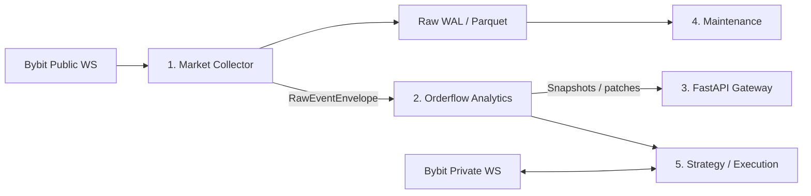

# Многопроцессная архитектура Bybit Orderflow

Разделение процессов уже не является преждевременным усложнением — это логичное следствие проведённых измерений. Однако делить систему сразу на пять процессов не стоит: безопаснее пройти путь **3 → 4 → 5 процессов**.



## Три процесса — первый этап

### 1. `market-collector`

Отвечает только за невосполнимое сырьё:

- подключение к Bybit WebSocket;
- heartbeat и reconnect;
- проверку sequence и регистрацию gaps;
- нормализацию и дедупликацию;
- WAL и сырой журнал;
- book checkpoints;
- standard orderbook, RPI orderbook, trades, liquidations и tickers.

В этом процессе не должно быть Walls, Absorption, Sweep, API, tiles и других производных расчётов.

### 2. Текущий FastAPI: analytics + API

На первом этапе FastAPI может временно сохранять аналитику и HTTP/WebSocket API в одном процессе.

Ошибки аналитики смогут заморозить интерфейс и производные данные, но больше не остановят необратимый сбор рынка.

### 3. `maintenance-worker`

Существующий отдельный процесс:

- публикация pending-журналов;
- compaction;
- построение tiles;
- retention;
- обслуживание manifest.

Это минимальное разделение, которое сразу защищает главное — непрерывность сырого сбора.

## Четыре процесса — рекомендуемая рабочая архитектура

После стабилизации FastAPI следует разделить ещё на два процесса.

### `orderflow-worker`

- Footprint, Delta и CVD;
- attribution;
- Absorption, Sweep и Walls;
- агрегаты и derived snapshots;
- replay производных данных.

Этот процесс может отстать, перейти в `DEGRADED`, перезапуститься и догнать журнал, не влияя на collector.

### `api-gateway`

- REST API;
- браузерный WebSocket;
- выдача истории;
- snapshot + patches;
- управление клиентскими сессиями.

API-процесс не должен выполнять тяжёлые вычисления.

Фактически рядом будут работать четыре демона:

1. collector;
2. analytics;
3. API;
4. maintenance.

## Пятый процесс — перед реальной торговлей

### `strategy-execution`

- принимает только события с `signalEligible=true`;
- проверяет `expiresAtMs`;
- сохраняет фактически увиденный `featureSnapshot`;
- обслуживает private WebSocket;
- восстанавливает позиции и заявки;
- выполняет reconciliation;
- применяет риск-лимиты;
- отправляет торговые команды.

Этот процесс нельзя объединять с публичным collector: зависшая стратегия не должна влиять на запись рыночных данных.

## Передача данных без Redis

Для локальной односерверной схемы Redis не обязателен.

```text
collector:
    сначала append в WAL
    затем отправка envelope через Unix socket

analytics:
    принимает события в режиме at-least-once
    хранит durable checkpoint
    при пропуске или рестарте дочитывает WAL
```

Collector никогда не должен ждать analytics. Если IPC-очередь заполнена:

- сырьё продолжает записываться;
- live-уведомления можно объединить или пропустить;
- analytics переходит в состояние `LAGGING`;
- затем analytics догоняет WAL с сохранённого checkpoint.

Рекомендуемый envelope:

```text
protocolVersion
source
venue
category
symbol
connectionEpoch
sourceSequence
eventTime
receiveTime
dataRevision
quality
payload
```

Гарантия exactly-once для IPC не требуется. Достаточно at-least-once, детерминированного ключа события и идемпотентного replay.

## Разные критерии качества для разных процессов

### Collector

- ноль потерь сырья;
- ноль необозначенных gaps;
- bounded writer lag;
- отсутствие блокировки со стороны downstream-процессов.

### Analytics

- допускается ограниченное время в `DEGRADED`;
- допустим replay и отставание;
- collector при этом не замедляется;
- некачественные сигналы получают `signalEligible=false`.

### API

- допускается reconnect клиента;
- состояние восстанавливается через snapshot;
- пропуск patches вызывает смену `streamEpoch` и новый snapshot.

### Maintenance

- допустим backlog, пока сохраняется запас диска;
- compaction и tiles не блокируют collector;
- операции остаются crash-safe и manifest-driven.

### Execution

- строгая задержка;
- проверка срока действия сигнала;
- запрет торговли на неполных или устаревших данных;
- обязательный журнал фактически принятых решений.

## Ограничения многопроцессной схемы

Несколько процессов устраняют общий GIL, но не создают бесконечные вычислительные ресурсы. Процессы продолжают конкурировать за CPU, память и диск.

Поэтому:

- maintenance запускается с низким приоритетом;
- analytics использует bounded queue и контролируемое отставание;
- collector получает наивысший эксплуатационный приоритет;
- тяжёлые зависимости вроде PyArrow не импортируются в минимальный collector без необходимости;
- одновременно выполняется не более одной тяжёлой операции обслуживания;
- каждый процесс публикует собственные health-метрики.

## Порядок перехода

1. Текущую ветку больше не расширять: завершить soak и слить.
2. Следующей веткой вынести только collector.
3. Проверить, что остановка или `SIGKILL` analytics/API не прекращает сырой сбор.
4. Проверить восстановление analytics с durable checkpoint и WAL.
5. После изоляции collector включить RPI raw-only.
6. Затем отделить analytics от API.
7. Пятый процесс добавить вместе со стратегией и исполнением.

## Обязательные интеграционные проверки

- остановка analytics не останавливает collector;
- остановка API не останавливает collector и analytics;
- остановка maintenance не влияет на live ingestion;
- после рестарта analytics детерминированно догоняет WAL;
- заполненная IPC-очередь не блокирует запись сырья;
- повторно доставленное событие не удваивает агрегаты;
- gap marker передаётся во все зависимые модули;
- все процессы работают из одного release SHA и совместимой версии протокола;
- API после reconnect получает корректный snapshot и продолжает patches;
- execution не принимает `PROVISIONAL`, `DEGRADED` или просроченный сигнал.

## Итоговая рекомендация

Оптимальная конечная конфигурация для проекта — **четыре процесса на текущем этапе и пятый перед реальной торговлей**.

Главный выигрыш заключается не только в скорости. Сбой любого производного модуля больше физически не сможет остановить приём и уничтожить невосполнимую рыночную историю.
